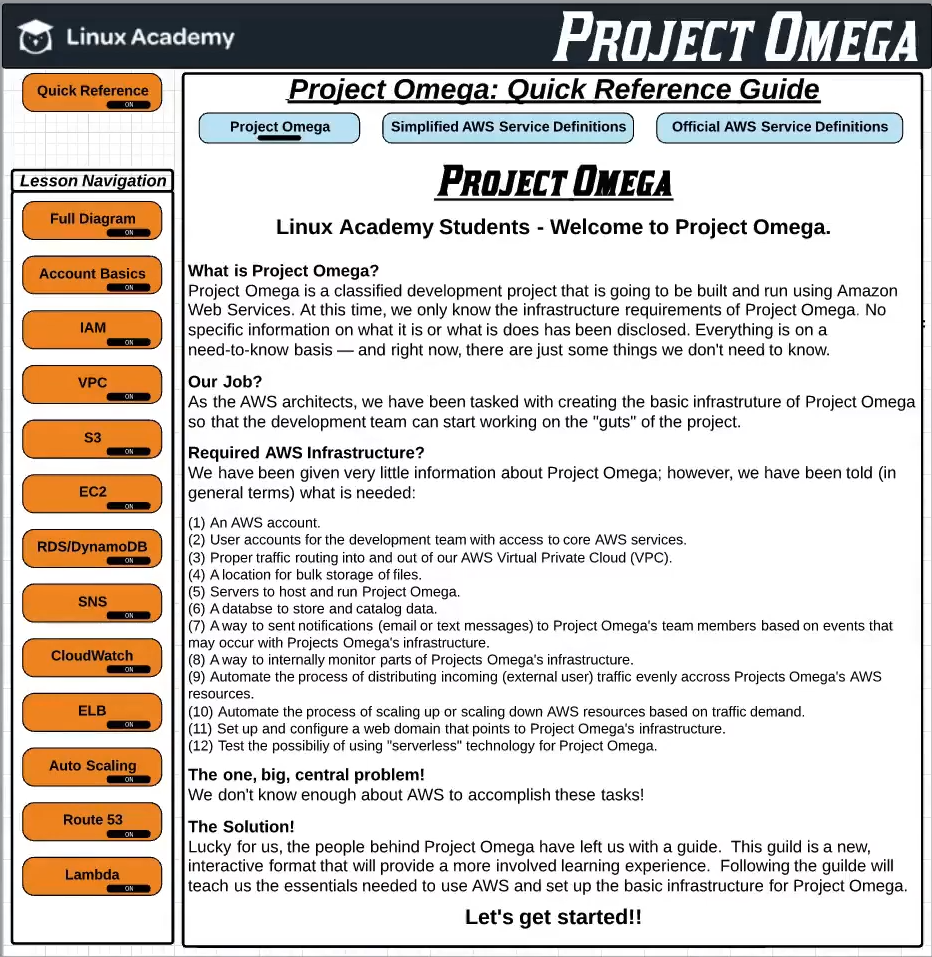

# Learning Through Project Omega

<figure><figcaption></figcaption></figure>

Here is the link to the interactive chart: [https://lucid.app/lucidchart/0f027ac0-3b2e-4509-847a-429b85325693/edit?invitationId=inv\_c9a2bd4f-cd1a-416b-bd77-728016c16c84](https://lucid.app/lucidchart/0f027ac0-3b2e-4509-847a-429b85325693/edit?invitationId=inv_c9a2bd4f-cd1a-416b-bd77-728016c16c84)

We can follow along the tutorial using this interactive diagram.
