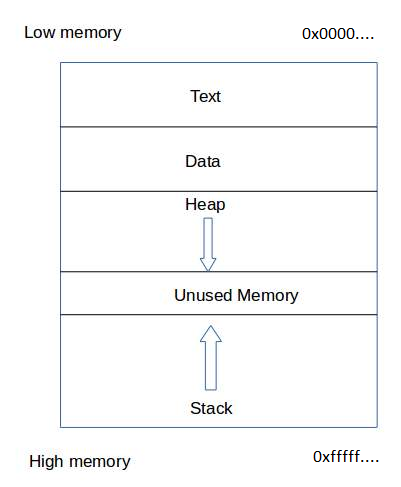

# Buffer Overflow Prep

## [Basics](./#undefined)

#### What is stack?

A stack is a limited access data structure – elements can be added and removed from the stack only at the top. It works on LIFO(last-in-first-out) principle.

Stack supports two operations push and pop.\
**Push:** Adds an item to the top of the stack.\
**Pop:** Removes an item from the top of the stack.

Stack can be visualised as:

<div align="left">



</div>

**Text:** Contains program code to be executed.\
**Data:** Contains global information for program.\
**Stack:** Contains function parameters, return addresses and the local variables of the function are stored.\
It’s a LIFO structure. It grows downward in memory (from higher address space to lower address space) as new function calls are made.

* **EIP** instruction pointer
* **ESP** stack pointer
* **EBP** base pointer
* **ESI** source index
* **EDI** destination index
* **EAX** accumulator
* **EBX** base
* **ECX** counter
* **EDX** data

**EBP** points to higher memory address at the bottom of the stack.

**ESP** points to the top of the stack at lower memory location.&#x20;

**EIP** holds the address of next instruction to be executed. Our prime focus is on EIP register since we need to hijack execution flow. EIP read only register, so we cannot assign the memory address of the instruction to be executed to it.

## [Visualise Stack](./#visualise-stack)


```
#include  

void do_something(char *Buffer)
{
     char MyVar[128];
     strcpy(MyVar,Buffer);
}

int main (int argc, char **argv)
{
     do_something(argv[1]);
}
```

<div align="left">


</div>

In programming, Prologue is what happens at the beginning of a function. Its responsibility is to set up the _stack frame_ of the called function. "Machine" allocates multiple blocks to a thread and assigns pointer to ensure flow. Let's call it the execution model.

1. 128 bytes get reserved for myVar variable
2. An EBP address is saved in the immediate next block
3. EIP address is saved in the immediate next block which points to the next instruction
4. Pointer to CLI input (irrelevant to our cause)
5. ESP => Always points to the top of stack

When strcpy() runs, it starts writing data downwards like this:

<div align="left">


</div>

Now, when we input data > 128 bytes, buffer gets overflowed

<div align="left">


</div>

**VERY IMPORTANT**: The prologue is what happens at the beginning of a function. Its responsibility is to set up the _stack frame_ of the called function. The epilogue is the exact opposite: it is what happens last in a function, and its purpose is to restore the stack frame of the calling (parent) function.

Here, after the input has been taken, epilogue makes the ESP move/point to the location stored in EIP (Saved EIP block). And through our input buffer, we have the control of EIP! This is the basis of stack based buffer overflow!

## [The JMP ESP and NOPSled funda](./#undefined)

Now that we have access to EIP, we can use this to manipulate ESP into running our code. We will add our shellcode to a location where ESP directly points at. Windows binaries utilise DLLs that have various instructions. "JMP ESP" is a fairly common assembly instruction that makes an ESP point to these intructions for a program to work efficiently.

What we will do? => Since we have control of the EIP, we can make EIP point to the address of JMP ESP and add our shellcode to this location in order for ESP to execute it.

NOPSled => During execution, addresses may move slightly here and there due to unprecedented errors. Therefore we add some No Operations (OPCode =>\x90) which means do nothing and move to the next bye. That will make a slide for the ESP. Wherever ESP lands on this NOPSled, it will eventually reach our shellcode and execute it.&#x20;

### This is all you had to know for the basics

Now, practical demonstration can be found here:







BONUS: In recent GCC compilers, there is a default protection mechanism for buffer overflows hence, to compile your vulnerable binary use this command:\


Here, C program's name is overflow.c and output binary is bufferoverflow\
**`gcc -g -fno-stack-protector -z execstack -o bufferoverflow overflow.c`**
