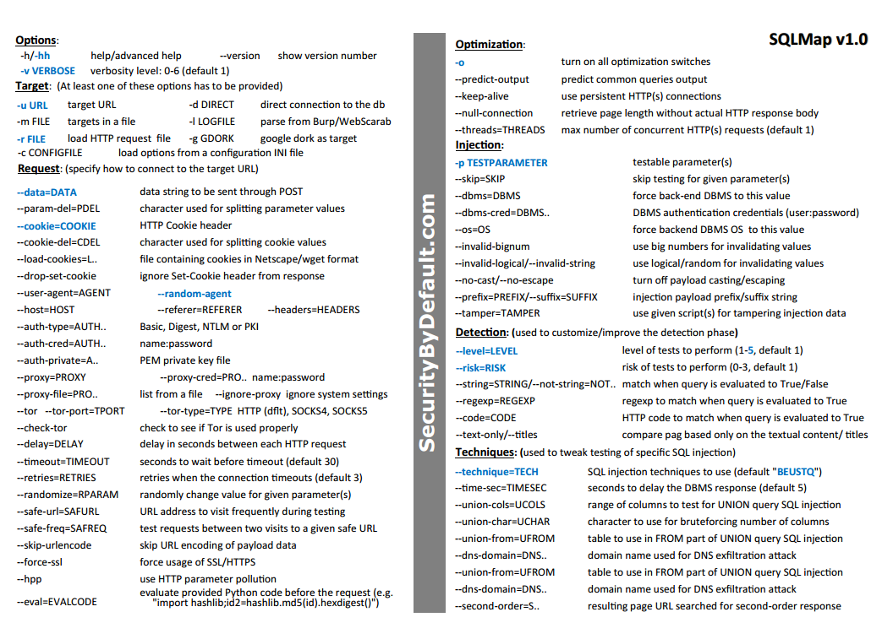

# SQLmap

### Trickery using 'copy as Curl' Commands

One of the best and easiest ways to properly set up an SQLMap request against the specific target (i.e., web request with parameters inside) is by utilizing `Copy as cURL` feature from within the Network (Monitor) panel inside the Chrome, Edge, or Firefox Developer Tools: 

By pasting the clipboard content (`Ctrl-V`) into the command line, and changing the original command `curl` to `sqlmap`, we are able to use SQLMap with the identical `curl` command:

Running SQLMap on an HTTP Request

```shell-session
$ sqlmap 'http://www.example.com/?id=1' -H 'User-Agent: Mozilla/5.0 (X11; Ubuntu; Linux x86_64; rv:80.0) Gecko/20100101 Firefox/80.0' -H 'Accept: image/webp,*/*' -H 'Accept-Language: en-US,en;q=0.5' --compressed -H 'Connection: keep-alive' -H 'DNT: 1'
```

When providing data for testing to SQLMap, there has to be either a parameter value that could be assessed for SQLi vulnerability or specialized options/switches for automatic parameter finding (e.g. `--crawl`, `--forms` or `-g`).


<figure><figcaption></figcaption></figure>

